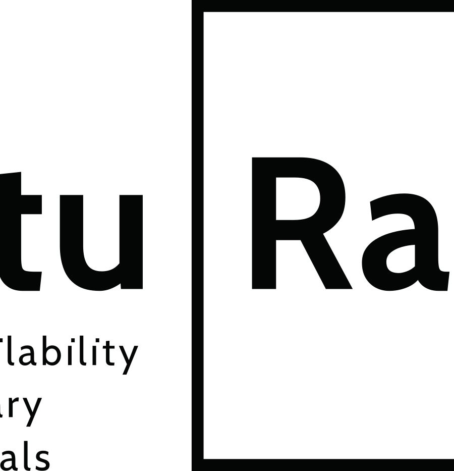

<!--    -->

<!-- 

  
 

 -->

# FutuRaM - Work Package 2  <!-- omit in toc -->

## *Foresight for Future Secondary Raw Materials* <!-- omit in toc -->

## **Task 2.1: Future scenarios for secondary raw material recovery in the EU** <!-- omit in toc -->

**Pursuant to milestone 11, the following is a draft report describing the future scenarios for FutuRaM.**
   
Date: 2023-06-12

----

## I. Introduction

The FutuRaM project seeks to quantify the current and future availability of secondary raw materials
(SRM) with a focus on critical raw materials (CRM) for six waste streams.

These are:

- waste electrical and electronic equipment (WEEE)  
- waste batteries (BAT)  
- end-of-life vehicles (ELV)  
- mining waste (MIN)  
- slags and ashes (SLASH)  
- construction and demolition (CDW)  

Work package 2 (WP2) is conducting foresight studies for materials critical to the EU economy, or materials that have significant impacts on EU sustainability because of their large volumes.

WP2 is developing a set of coherent scenarios for material use and waste/recovery over time in various sectors in the EU.

This report describes the three scenarios and the process by which they were developed.  

The scenarios are:

- Business as usual (BAU)
- Recovery (REC)
- Circularity (CIR)

## II. Executive summary

This report presents the first phase of the scenario development process – the storyline narrative phase. Three distinct future scenarios have been drafted up to the year 2050, Business as usual, Recovery and Circularity. The scenarios are designed to be internally consistent and to provide a overview of the potential future landscape of waste management and SRM recovery within the EU. The scenario development process employs a methodology that integrates both forecasting and backcasting techniques to construct a comprehensive, future-facing knowledge base that can aid fact-based decision-making.

**Business as Usual (BAU):**  
The BAU scenario extends the current situation into the future with limited deviation from existing patterns. Utilising backcasting and forecasting techniques, it assesses a potential future where there might be minor advancements in resource efficiency, recovery technology, and energy transition, but where primary extraction of raw materials remains the primary practice.  

**Recovery:**  
The Recovery scenario envisions a future that employs sophisticated technology to dramatically enhance SRM recovery from waste streams. It presents a future where the EU successfully meets its recycling and recovery targets through an effective waste management system and circular design principles. The scenario envisions an increased recovery rate of SRMs, extensive use of digitalisation and automation in recycling processes, and the implementation of new waste regulations in alignment with EU targets.  

**Circularity:**  
The Circularity scenario encapsulates the fullest possible realisation of a circular economy, extending beyond end-of-life recovery of materials to minimising waste at all stages of production and consumption. It envisions a future where the EU's targets for recycling, recovery, and circularity are met through extensive stakeholder collaboration, the emergence of new business models, and increased use of renewable energy and circular economy technologies.  

In subsequent phases of the scenario development process, future product composition and recovery technology will be examined, scenario elements will be quantified, and all scenario data will be integrated and coupled with the quantitative models for waste generation and SRM recovery.  

Through the development of these scenarios, the FutuRaM project aims to provide a nuanced understanding of the potential future waste management and resource recovery landscape within the EU. This approach offers insights into key drivers, uncertainties, and the potential impacts of policy interventions and technological advancements. By aligning SRM recovery projects more closely with the United Nations Framework Classification for Resources (UNFC), the project aims to enable the commercial exploitation of SRMs and CRMs by manufacturers, recyclers, and investors. Ultimately, the comprehensive knowledge base developed through this process is designed to support and inform the decision-making processes of policymakers and governmental authorities.

----

## III. Table of contents
<!-- toc-->
- [I. Introduction](#i-introduction)
- [II. Executive summary](#ii-executive-summary)
- [III. Table of contents](#iii-table-of-contents)
- [IV. Summary of scenario storylines](#iv-summary-of-scenario-storylines)
- [V. Acronyms](#v-acronyms)
- [VI. Terminology](#vi-terminology)
- [1. Description of Task 2.1: Storylines](#1-description-of-task-21-storylines)
  - [1.1. Associated milestones](#11-associated-milestones)
  - [1.2. Associated subtasks](#12-associated-subtasks)
- [2. Methodology](#2-methodology)
  - [2.1. Step 1: Defining the scope and objectives](#21-step-1-defining-the-scope-and-objectives)
    - [2.1.1. Scope and objectives of the scenario development process](#211-scope-and-objectives-of-the-scenario-development-process)
    - [2.1.2 Consideration of EU legislation and policy targets](#212-consideration-of-eu-legislation-and-policy-targets)
      - [2.1.2.1. General policies and legislation](#2121-general-policies-and-legislation)
      - [2.1.2.2.  Waste stream specific legislation and policy targets](#2122--waste-stream-specific-legislation-and-policy-targets)
    - [2.1.2.3. Extent of policy and legislation inclusion in the scenarios](#2123-extent-of-policy-and-legislation-inclusion-in-the-scenarios)
    - [2.1.3 Consideration of geopolitical developments](#213-consideration-of-geopolitical-developments)
  - [2.2. Step 2: Determine methodology](#22-step-2-determine-methodology)
    - [2.2.1. Methodology types and selection criteria](#221-methodology-types-and-selection-criteria)
    - [2.1.2. Choice of methodology](#212-choice-of-methodology)
    - [2.2.3. Choice of scenario type](#223-choice-of-scenario-type)
  - [2.3. Step 3: Marker scenario mapping](#23-step-3-marker-scenario-mapping)
  - [2.4. Step 4: Identification of key drivers of change](#24-step-4-identification-of-key-drivers-of-change)
  - [2.5. Step 5: Develop storyline themes](#25-step-5-develop-storyline-themes)
  - [2.6. Step 6: Qualitative narrative development](#26-step-6-qualitative-narrative-development)
  - [2.7. Step 7: Definition of scenario parameters](#27-step-7-definition-of-scenario-parameters)
  - [2.8. Step 8: Quantitative modelling](#28-step-8-quantitative-modelling)
  - [2.9. Step 9: Implementation](#29-step-9-implementation)
  - [2.10. Step 10: Review process](#210-step-10-review-process)
- [3. Scenario storylines](#3-scenario-storylines)
  - [3.1. Scenario 1: Business as usual](#31-scenario-1-business-as-usual)
    - [3.1.1. Storyline narrative](#311-storyline-narrative)
    - [3.1.2. Waste stream specific scenario impacts](#312-waste-stream-specific-scenario-impacts)
  - [3.2. Scenario 2: Recovery](#32-scenario-2-recovery)
    - [3.2.1. Storyline narrative](#321-storyline-narrative)
    - [3.2.2. Waste stream specific scenario impacts](#322-waste-stream-specific-scenario-impacts)
  - [3.3. Scenario 3: Circularity](#33-scenario-3-circularity)
    - [3.3.1. Storyline narrative](#331-storyline-narrative)
    - [3.3.2. Waste stream specific scenario impacts](#332-waste-stream-specific-scenario-impacts)
- [4. Scenario quantification](#4-scenario-quantification)
- [5. References](#5-references)
- [6. Appendices](#6-appendices)
  - [6.1. List of acronyms](#61-list-of-acronyms)
  - [6.2. List of terminology](#62-list-of-terminology)
  - [6.3. Methods and tools considered in the FutuRaM scenario development process](#63-methods-and-tools-considered-in-the-futuram-scenario-development-process)
  - [6.4. List of sources identified in the process of marker scenario mapping](#64-list-of-sources-identified-in-the-process-of-marker-scenario-mapping)
  - [6.5. List of drivers/factors identified in the initial collection phase](#65-list-of-driversfactors-identified-in-the-initial-collection-phase)
  - [6.6. List of drivers/factors identified in the screening phase](#66-list-of-driversfactors-identified-in-the-screening-phase)
<!-- toc-end-->
## IV. Summary of scenario storylines

### Scenario I: Business as usual (BAU) <!-- omit in toc -->

See [Section 3.1](#31-scenario-1-business-as-usual) for the full scenario description waste stream specific scenario impact narratives.

This scenario envisions the future based on the current situation, extending to 2050 with very little deviation from present consumption patterns and the secondary raw material (SRM) system. While there may be advances in some areas such as resource efficiency, recovery technology, and the energy transition, substantial modifications remain hindered by economic, social, and political constraints. The primary extraction of raw materials continues to be the primary source to meet the EU's demand.

In the Business as usual (linear economy) scenario, the following are key characteristics:

- A forecasting model is used to predict the future based on the current situation and the development of existing trends.
- EU targets including those for recycling and recovery are not met, and the current linear model largely persists.
- Material demand keeps pace with GDP growth, perpetuating a trend of increasing consumption.Primary mining and extraction persist as the leading sources of raw materials, underlining the dependency on traditional extraction methods.
- Recycling and recovery rates continue to lag, leading to an accumulation of SRM waste that signals missed opportunities for resource reuse.
- The environmental repercussions of mining and extraction, such as land degradation and water pollution, continue to be a pressing concern, reflecting the ecological toll of this linear model.
- The EU's dependency on imports of SRMs escalates, heightening the risk of supply disruptions.Investment in new SRM recovery technologies remains minimal, stifling innovation and advancements in this field.
- The industrial focus remains on cost-effective material production and use, disregarding the long-term sustainability aspect.
- Material scarcity and price fluctuations pose potential risks to the EU industry, highlighting the vulnerability of this business model.
- Without any significant updates to environmental regulations, the negative impacts on ecosystems and biodiversity intensify.
- Working conditions in mining and extraction industries see no substantial improvements, highlighting continued issues of social inequality.
- The EU's reliance on fossil fuels continues, with the energy transition progressing at a slow pace.
- The EU's dependency on imports of SRMs escalates, heightening the risk of supply disruptions.

### Scenario II: Recovery <!-- omit in toc -->

See [Section 3.2](#32-scenario-2-recovery) for the full scenario description and the waste stream specific scenario impact narratives.

In the recovery scenario, the central emphasis is on harnessing sophisticated technologies to salvage SRMs from waste streams at the end of their lifecycle. While there are noticeable strides towards the incorporation of 'circular design' principles and re-X strategies (which focus on reducing, reusing, recycling, repairing, and refurbishing), a vestige of wasteful consumerism, akin to the one observed in the BAU scenario, still lingers. However, this is somewhat mitigated by the implementation of a comprehensive material recovery system.

Key characteristics of this technology promoted recovery scenario include:

- This scenario uses a combination of the forecasting and backcasting methods to envision the future.
- The backcasting method is used for scenario factors that are covered by governmental targets, starting with the desired outcome and working backwards to the present.
- The forecasting method is used for scenario factors that are not covered by governmental targets, starting with the current situation and extending to the future.
- EU targets for recycling and recovery are met, due to the EU's waste management system becoming more expansive, efficient and effective.
- Technological innovation drives increased recovery rates of SRMs, enabling the more efficient use of waste.
- Digitalisation and automation are more extensively used in recycling processes, leading to enhanced productivity and accuracy.
- There is greater exploration and exploitation of alternative sources such as urban mining, waste streams, and tailings, presenting novel opportunities for resource acquisition.
- New waste regulations and guidelines for SRM recovery are implemented, enforcing better management and extraction of SRMs.
- Investment in research and development for SRM recovery technologies experiences an upswing, promoting continuous innovation in this field.
- Closer collaboration and information sharing between industry and government institutions streamline processes and expedite decision-making.
- New jobs are created in the recycling and recovery sector, offering economic benefits and improving overall employment rates.
- SRM production and use become more efficient and cost-effective, fostering economic sustainability.
- Environmental impact from mining and extraction is reduced, signaling a more sustainable approach to resource acquisition.

### Scenario III: Circularity <!-- omit in toc -->

See [Section 3.3](#33-scenario-3-circularity) for the full scenario description and the waste stream specific scenario impact narratives.

In this scenario, we move in the direction of the maximum achievable state of material efficiency as government policy, private innovation and social changes are rapidly driving the transition toward a circular economy. The emphasis here rests heavily on re-X strategies that are implemented in the design phase of products (e.g., repairability and re-manufacturability) and that are actualised by changes in consumer behaviour (e.g reduction, refusal, engagement in the ‘sharing-economy’ and curtailment of the ‘throw-away’ mindset). Further, being enabled by the widespread adoption of ‘circular design’ principles and improvements in information transparency (e.g., waste tracking and digital product passports) the system for the treatment of post-consumer waste can divert a significant amount of their inflows (to, for example, re-use and re-manufacture) with the residual fraction being readily segregated into purer, more efficiently recoverable, material streams. This scenario envisions a future where government policies are in synergy with private sector innovation and societal changes, driving a wholesale transition towards a circular economy. Unlike the recovery scenario, where the focus is on the end-of-life recovery of materials, this scenario emphasises minimising waste at all stages, starting from the design phase itself.

The circular economy scenario is characterised by the following:

- This scenario uses a combination of the forecasting and backcasting methods to envision the future.
- The backcasting method is used for scenario factors that are covered by governmental targets, starting with the desired outcome and working backwards to the present.
- The forecasting method is used for scenario factors that are not covered by governmental targets, starting with the current situation and extending to the future.
- EU targets for recycling and recovery are met, as are those for circularity, due advances in waste management, ecodesign and re-X strategies.
- A circular economy is implemented, prioritising waste reduction, resource efficiency, and a shift from the 'take-make-dispose' model.
- A notable increase in SRM recycling and recovery rates, indicating an efficient use of resources.
- A larger emphasis on designing products for reuse and recycling, making waste a valuable resource rather than a problem.
- More extensive use of renewable energy and clean technologies in SRM production and use, supporting a low-carbon economy.
- Collaboration between stakeholders, including industry, government, and consumers, improves, enhancing the implementation of circular practices.
- New business models like leasing and take-back schemes emerge, altering traditional consumption patterns.
- Digitalisation and data use are heightened to improve efficiency and traceability, aiding in effective resource management.
- Investment in research and development for circular economy technologies increases, driving innovation and adoption.
- Awareness and education around sustainable consumption and production practices are amplified, leading to behavioural changes in society.
- Environmental impacts from mining and extraction reduce, and reliance on imports decreases, suggesting greater self-sufficiency and sustainability.

## V. Acronyms

| Acronym | Definition                                                            |
|---------|-----------------------------------------------------------------------|
| SRM     | Secondary Raw Material                                                |
| CRM     | Critical Raw Material                                                 |
| WEEE    | Waste Electrical and Electronic Equipment                             |
| BATT    | Waste Batteries                                                       |
| ELV     | End-of-Life Vehicles                                                  |
| MIN     | Mining Waste                                                          |
| SLASH   | Slags and Ashes                                                       |
| CDW     | Construction and Demolition Waste                                     |
| LCA     | Life Cycle Assessment                                                 |
| S-LCA   | Social Life Cycle Assessment                                          |
| UNFC    | United Nations Framework Classification for Resources                 |
| AI      | Artificial Intelligence                                               |
| EU      | European Union                                                        |
| EEE     | Electrical and Electronic Equipment                                   |
| REACH   | Registration, Evaluation, Authorization, and Restriction of Chemicals |
| GDP     | Gross Domestic Product                                                |
| BAU     | Business as Usual                                                     |
| R&D     | Research and Development                                              |
| EoL     | End-of-Life                                                           |
| EoU     | End-of-Use                                                            |
| CE      | Circular Economy                                                      |
| EoW     | End-of-Waste                                                          |
| EPR     | Extended Producer Responsibility                                      |
| WFD     | Waste Framework Directive                                             |
|         |                                                                       |

## VI. Terminology

The table below provides an abbreviated list of terminology used in this report.
See [6.2. List of terminology](#62-list-of-terminology) for a complete list.

| Term                   | Definition                                                                                                            |
|------------------------|-----------------------------------------------------------------------------------------------------------------------|
| Secondary Raw Material | A material that has been recovered from waste and can be used as a substitute for a primary raw material.             |
| Critical Raw Material  | A raw material that is economically and strategically important to the EU, but with a high risk of supply disruption. |
| Scenario               | A plausible and coherent description of how the future may develop based on a set of assumptions.                     |
| Storyline              | A qualitative description of a scenario, including the key drivers, actors and events.                                |
| Business-as-usual      | A scenario that assumes no significant changes in current trends and policies.                                        |
| Recovery               | The process of recovering SRMs from waste streams.                                                                    |
| Circular economy       | An economic system that prioritises waste reduction and resource efficiency.                                          |
| Re-X                   | A general term for reuse, repair, refurbishment, remanufacturing and recycling.                                       |
| Forecasting            | A method for predicting future trends based on historical data.                                                       |
| Backcasting            | A method for predicting future trends based on a desired future state.                                                |

## 1. Description of Task 2.1: Storylines  

[Back to Table of Contents](#iii-table-of-contents)

This task involves scanning, mapping, and assessing scenarios used in the grey, scientific, policy, and industry literature/reporting for the different waste streams, (e.g. the Shared Socioeconomic Pathways, the International Resource Panel Scenarios, the International Energy Agency Scenarios, etc) to develop cogent storylines for the three planned scenarios. These will cut across sectors and will be used for the Stock-Flow models (WP4) and will include the translation of general concepts such as stated policies, sustainable development, circular economy, to each sector. FutuRaM will develop at minimum three scenarios (1. Sustainability, 2. Recoverability, and 3. Business-as-usual).

### 1.1. Associated milestones

| Milestone | Milestone name                                                    | WP | Due date  | Responsible partner | Means of verification                                                                                                              |
|-----------|-------------------------------------------------------------------|----|-----------|---------------------|------------------------------------------------------------------------------------------------------------------------------------|
| MS11      | Mapping of published scenarios and Storyline/scenario description | 2  | Dec. 2023 | ULEI                | Dataset on available scenarios is fed into D1.1 and qualitative descriptions of 3 futures for the six waste streams are circulated |

### 1.2. Associated subtasks

| WP | Task | Sub Task | Sub Task Name                    | Waste Group   | Description Sub Task/Step                                                                                                                                                   | Start Month | End Month | Contributors                                                                                  | Status  |
|----|------|----------|----------------------------------|---------------|-----------------------------------------------------------------------------------------------------------------------------------------------------------------------------|-------------|-----------|-----------------------------------------------------------------------------------------------|---------|
| 2  | 2.1  | 2.1      | Scenario mapping                 | Cross Cutting | Map various studies from the academic, policy, and grey literature for future scenarios and assess the applicability within FutuRaM                                         | M01         | M05       | WEEE Forum, UNITAR, BRGM, Chalmers, GTK, LMU, RECHARGE, SGU, TUB, Leiden Uni, VITO, Empa, UCL | x       |
| 2  | 2.1  | 2.2      | Scenario methods                 | Cross Cutting | Compile various methodologies for scenario development and assess their applicability for developing scenarios on material recovery and circular economy for Europe         | M02         | M05       | WEEE Forum, UNITAR, BRGM, Chalmers, GTK, LMU, RECHARGE, SGU, TUB, Leiden Uni, VITO, Empa, UCL | x       |
| 2  | 2.1  | 2.3      | Scenario storylines              | Cross Cutting | Flesh out the storylines of the 3 main scenarios                                                                                                                            | M05         | M08       | UNITAR, Chalmers, TUB, Leiden Uni                                                             | x       |
| 2  | 2.1  | 2.4      | Qualitative scenario development | Cross Cutting | Use the chosen methods and qualitative methods to develop the three main scenarios to be used in FutuRaM (e.g. BAU, increased material recovery, and full circular economy) | M07         | M11       | UNITAR, Chalmers, SGU, Leiden Uni, VITO, UCL                                                  | DRAFTED |

## 2. Methodology

### A conceptual framework for scenario development  <!-- omit in toc -->

[Back to Table of Contents](#iii-table-of-contents)  

The conceptual framework for scenario development is based on the following principles.

The scenarios should:

- Be based on the best available scientific knowledge and data.
- Provide a coherent and consistent picture of the future.
- Provide decision makers with knowledge related to the possible consequences of their decisions.
- Consider a range of plausible future outcomes, accounting for uncertainties and alternative trajectories.
- Be developed in a participatory and collaborative manner, involving relevant stakeholders and experts.
- Be transparent and well-documented, allowing for replication and further analysis.
- Be flexible and adaptable, allowing for updates and adjustments as new information becomes available.
- Consider the interconnections and interactions between different sectors, waste streams, and policy domains.
- Take into account the broader societal, economic, and environmental context in which the waste streams operate.
- Incorporate a long-term perspective, considering the potential impacts and implications over several decades.
- Capture both quantitative and qualitative aspects, integrating data-driven modelling with qualitative narratives and storylines.
- Be regularly reviewed and updated to reflect evolving knowledge, technological advancements, and policy developments.
- Be used as a tool for learning and exploration, encouraging dialogue and collaboration among stakeholders.
- Inform policy and decision-making processes, providing insights into the potential consequences of different choices and interventions.
- Be communicated effectively to a wide range of audiences, ensuring accessibility and clarity of information.
- Contribute to the advancement of knowledge and understanding in the field of waste management, resource recovery, and circular economy.

By adhering to these principles, the FutuRaM project aims to develop robust, informative, and policy-relevant scenarios that support sustainable decision-making and contribute to the transition towards a more circular and resource-efficient economy. The methodology ensures that the scenarios capture the complexity and interconnectedness of the waste streams, taking into account various factors such as legislation, technology, geopolitics, and societal values. Ultimately, the goal is to provide decision makers with valuable insights and tools to navigate the challenges and opportunities associated with secondary raw materials in a rapidly changing world.

### Scenario storyline development process <!-- omit in toc -->

Building scenarios involves several steps and methodologies, which can vary depending on the specific context and objectives. The following section provides an overview of the scenario development process used in FutuRaM.

  

### 2.1. Step 1: Defining the scope and objectives  

Back to [Table of Contents](#iii-table-of-contents)

#### 2.1.1. Scope and objectives of the scenario development process  

The scope and objectives of the scenario development process is defined in the context of the overall aim, scope and objectives of the FutuRaM project.

 

**Aim**:

> FutuRaM will develop the Secondary Raw Materials knowledge base on the availability and recoverability of secondary raw materials (SRMs) within the European Union (EU), with a special focus on critical raw materials (CRMs). The project research will enable fact-based decision making for the recovery and use of SRMs within and outside the EU, and disseminate the data generated via an accessible knowledge base developed in the project.

 

**Scope**:

> FutuRaM will establish a methodology, reporting structure, and guidance to improve the raw materials knowledge base up to 2050. FutuRaM will focus on six waste streams: batteries; electrical and electronic equipment; vehicles; mining; slags and ashes; and construction and demolition. It will integrate SRM and CRM data to model their current stocks and flows, and consider economic, technological, geopolitical, regulatory, social and environmental factors to further develop, demonstrate and align SRM recovery projects with the United Nations Framework Classification for Resources (UNFC), a tool that enables a better understanding of the viability of raw material projects. This will enable the commercial exploitation of SRMs and CRMs by manufacturers, recyclers, and investors, and the knowledge base developed in the project will support policy makers and governmental authorities.

 

**Selected objectives**:

| Need                                                                                                                                                                                                                                                                                                                                                                                                                                                                                                                                                                                                                                                                                                                                                                                                                                                                                              | Action                                                                                                                                                                                                                                                                                                                                                                                                                                                                                                                                                                                                                                                                              |
|---------------------------------------------------------------------------------------------------------------------------------------------------------------------------------------------------------------------------------------------------------------------------------------------------------------------------------------------------------------------------------------------------------------------------------------------------------------------------------------------------------------------------------------------------------------------------------------------------------------------------------------------------------------------------------------------------------------------------------------------------------------------------------------------------------------------------------------------------------------------------------------------------|-------------------------------------------------------------------------------------------------------------------------------------------------------------------------------------------------------------------------------------------------------------------------------------------------------------------------------------------------------------------------------------------------------------------------------------------------------------------------------------------------------------------------------------------------------------------------------------------------------------------------------------------------------------------------------------|
| A successful transition to a climate-neutral, circular and digitised EU economy relies heavily on a secure supply of raw materials. In order to strengthen EU autonomy and reduce over-dependency, we must boost domestic sourcing, both for primary and SRMs                                                                                                                                                                                                                                                                                                                                                                                                                                                                                                                                                                                                                                     | FutuRaM will quantify the future availability of SRMs for three future scenarios for the EU material economy, from following current consumption trends, to moderate or rapid transitioning toward a climate-neutral, circular, and digitised EU economy (WP2). The material demand and the SRMs supply for each scenario and raw material imports to evaluate EU material autonomy.                                                                                                                                                                                                                                                                                                |
| Presently, several socioeconomic scenarios have been developed at national, EU, and/or global scales to assess the energy and mobility transition.3 While some of these studies have partially included CRMs demand and focused on the potential supply risks for achieving climate targets, these prospective scenarios have not been effectively harmonised across industrial sectors, and generally lack information on SRMs and the recovery industry in general. Transitions toward sustainable societies are likely to involve major changes and increased complexity in the material economy. Further research into current and future SRMs and CRMs present in the urban mine is thus urgent to prepare industry for their eventual recovery. In addition, scenarios that include other Circular goals such as lifetime extension need to be better assessed in terms of material cycles. | FutuRaM will develop stock-flow models for six waste streams based on holistic scenarios to map current and future material use in the economy of the EU-27 plus Iceland, Norway, Switzerland and United Kingdom (EU27+4) and quantify their eventual end-of-life fate. FutuRaM will extend existing model approaches by a set of distinct scenarios which cover circular economy (e.g. lifetime extension through repair and remanufacturing), high SRMs recoverability, and business as usual. These scenarios will incorporate emerging recycling technologies in line with stakeholder dialogues that consider normative boundary conditions such as carbon neutrality by 2050. |

 

**Scope definition**:

Given this context, the scope of the scenario development process is to develop a set of plausible scenarios that explore the future of waste management, resource recovery, and circular economy in the EU. The scenarios will be used to identify key drivers and uncertainties that will influence the future of waste management and resource recovery. The scenarios will also be used to evaluate the potential impacts of different policy interventions and technological advancements.

*Thematic scope*
The scenarios are be centred on the six waste streams of FutuRaM: WEEE, ELV, BAT, CDW, MIN, and SLASH. Additionally, consideration will be given to sectors and policy domains that are relevant to these waste streams and the general context of the system. These include manufacturing, energy, transportation, as well as policy related to the environment, the economy, society, technology, and geopolitics.

*Geographic scope*
The scenarios will be developed for the EU-27 plus Iceland, Norway, Switzerland and United Kingdom (EU27+4). The scenarios will consider the current and future waste management practices and resource recovery technologies in these countries. Additionally, the scenarios will consider the current and future policies and targets related to waste management and resource efficiency in these countries. To some extent, the scenarios will also consider the current and future trade relationships between these countries and other countries around the world.

*Temporal scope*
The scenarios will be developed for the time horizon of 2025-2050. This time horizon is aligned with the long term targets of the EU, including the EU Green Deal, the EU Circular Economy Action Plan, and the EU Industrial Strategy. The discrete stages in the forecasts is planned to be: 2025, 2030, 2035, 2040, 2045 and 2050. The temporal resolution of the scenarios will be determined during the quantification phase of the scenario development process. While it is possible to develop scenarios with a high (or even continuous) temporal resolution, that of these scenarios will be determined based on the availability and quality of data. It is important to acknowledge that providing too high a temporal resolution may lead to a false sense of accuracy and precision.
  

**Aims and objectives definition**
The specific objectives that the FutuRaM scenarios aim to achieve presented in the following table.

| Aim                                                                                                                                                                                        | Objective                                                                                                                                                                                                                                                                                                                                                                                   |
|--------------------------------------------------------------------------------------------------------------------------------------------------------------------------------------------|---------------------------------------------------------------------------------------------------------------------------------------------------------------------------------------------------------------------------------------------------------------------------------------------------------------------------------------------------------------------------------------------|
| Quantifying the current and future availability of secondary raw materials (SRM), particularly critical raw materials (CRM), for the identified waste streams from 2025 until 2050.        | Develop a set of plausible scenarios that encompass these waste stream and provide quantitative estimates of the current and future availability of SRM and CRMs.                                                                                                                                                                                                                           |
| Informing private and public sector decision-making processes by assessing the impacts of different legislative and policy strategies related to waste management and resource efficiency. | The scenarios will cover a range of such strategies, grouped in coherent sets in each of the three storylines including recycling, reuse, remanufacturing, and landfilling. Integration of the scenario with the system model will allow assessment of the impacts of these strategies on not only the availability of SRM and CRMs, but also on the environment, the economy, and society. |

#### 2.1.2 Consideration of EU legislation and policy targets  

  The scenarios developed in FutuRaM includes the targets that the EU is setting for specific elements/materials/waste streams, following, in particular, the ambitions of the EU Green Deal @cite{EU2019} and the proposed critical raw materials (CRM) legislation @cite{EU2023}. Additionally, the consumer-product-centric waste streams BATT, ELV, and WEEE have specific EU legislation that will be considered in the scenarios.  

##### 2.1.2.1. General policies and legislation  

 **The EU Green Deal** is a set of policy initiatives by the European Commission with the overarching aim of making Europe climate neutral in 2050. This policy portfolio is a response to the Paris Agreement and the United Nations Sustainable Development Goals and it covers a wide range of economic sectors with an emphasis on investments toward building up local, 'sustainable' industries. The scope of FutuRaM is aligned with the EU Green Deal's goal of ensuring the sustainable sourcing and use of raw materials, reducing dependency on imports, and promoting resource security.

 **The EU Circular Economy Action Plan** is a policy framework developed by the European Commission to promote the circular economy in the European Union. It sets out a comprehensive set of measures and targets to improve resource efficiency, reduce waste, and foster sustainable production and consumption. The Action Plan includes initiatives related to product design, waste management, recycling, and resource efficiency, among others. The Action Plan is a key element of the European Green Deal and it is closely linked to the EU Industrial Strategy.

The plan:

- Aims to promote the transition to a more circular economy in the EU
- Sets out a range of measures to promote the sustainable use of resources, reduce waste, and increase recycling
- Includes proposals for new legislation, such as an EU-wide framework for the circular economy, and revisions to existing legislation, such as the WEEE Directive
- Emphasizes the importance of product design for the circular economy, and proposes measures to promote eco-design and repairability
- Includes initiatives to promote the use of secondary raw materials, such as the establishment of a European Raw Materials Alliance
- Aims to reduce greenhouse gas emissions and improve resource efficiency in the EU
Calls for increased cooperation and dialogue among stakeholders in the circular economy.  

**The Critical Raw Materials Act** is a proposed EU regulation that aims to ensure a secure and sustainable supply of raw materials to the EU. The Act identifies a list of strategic raw materials, which are crucial to technologies important to Europe's green and digital ambitions and for defence and space applications, that are subject to potential supply risks. The regulation will cover the entire raw materials value chain, from primary extraction to manufacture to its potential recovery as a secondary raw material.
  
By 2030, one single ex-EU country shall produce not more than 65% of the EU's annual consumption of each strategic raw material.  
Clear benchmarks have been set for domestic capacities of the EU in 2030:  

- extract at least 10% of the EU's annual consumption  
- process at least 40% of the EU's annual consumption  
- recycle at least 15% of the EU's annual consumption  

These benchmarks have been included in the scenarios developed in FutuRaM. Specifically, in the Recovery scenario, where the emphasis is on the recovery of materials from waste streams and the Circularity scenario where the emphasis is on the the implementation of 're-X' strategies, such as recycling, remanufacturing, and reuse. These benchmarks are considered too optimistic to be included in the Business-as-usual scenario.

##### 2.1.2.2.  Waste stream specific legislation and policy targets

With respect to the waste streams that are analysed in FutuRaM, the following waste stream-specific developments aligned with EU targets have been considered:

- BATT: Proposed revision of the Batteries Directive (2020/0353(COD)) {Vivienne2022}
  - Establishes rules for the collection, treatment, and recycling of batteries and accumulators in the EU
  - Requires Member States to set up collection and recycling systems for waste batteries and accumulators
  - Sets specific recycling targets for different types of batteries and accumulators
  - Prohibits the use of certain hazardous substances in the manufacturing of batteries and accumulators
  - Requires labeling and information for consumers on the proper disposal of batteries and accumulators
  - Requires producers to take responsibility for the costs of collecting, treating, and recycling waste batteries and accumulators
  - Aims to reduce the environmental impact of batteries and accumulators throughout their life cycle.
  
- ELV: Proposed revision currently under review now and to be completed during 2023:
  - Sets out rules for the collection, treatment, and recycling of end-of-life vehicles (ELV) in the EU
  - Requires Member States to set up collection systems for ELV and ensure that they are treated and recycled in an environmentally sound manner
  - Sets collection and recycling targets for ELV: 85% of the weight of each vehicle must be reused or recycled, and 95% of the weight of each vehicle must be reused, recycled, or recovered
  
- WEEE Directive (about to be evaluated with a review likely in 2024):
  - Sets out rules for the collection, treatment, and recycling of waste electrical and electronic equipment (WEEE) in the EU
  - Requires Member States to establish collection systems for WEEE and ensure that it is treated and recycled in an environmentally sound manner
  - Sets collection and recycling targets for different types of WEEE
  - Requires producers to take responsibility for the costs of treating and recycling WEEE
  - Requires the use of the waste hierarchy for WEEE management
  - Aims to prevent the generation of WEEE and promote its reuse and recycling
  - Requires the labeling of electrical and electronic equipment to facilitate its proper disposal.  
- CDW: No activity currently planned.  
- MIN: Focus is currently on human health and environmental impact rather than waste.  
- SLASH: No activity currently planned.  

#### 2.1.2.3. Extent of policy and legislation inclusion in the scenarios

The targets that result from the planned and ongoing review processes are non-negotiable and legally binding, and thus should be incorporated in our scenarios. These targets, however, are only applicable to post-consumer products, namely WEEE, BAT and ELV. This envisioned future in which legally binding targets for collection, reuse and/or material recycling are achieved can be implemented as the Recovery scenario. If there are no targets set for a specific consumer product category, then approach targets similar to the WEEE directive and in line with the EU Green Deal. For the Circularity scenario, FutuRaM will also consider the effects of proposed ecodesign requirements for sustainable products (e.g. longer lifetimes, increased reusability, repairability, recyclability).

However, for waste that that does not consist of discarded consumer products, but instead results from industrial production activities, in particular for MinW, and for SLASH, we must still produce specific scenarios related to mining, metallurgy, and waste and fuel combustion. The scenarios will account for increasing resource use effectiveness and production process efficiency, thus indicating lower volumes and quality of generated production residues (both by-products and waste such as red mud, waste rock, slags, etc) per unit of product (expressed either as product mass or product value), whether that product is a metal (e.g., a copper cathode), metal alloy (e.g. aluminium alloy n° 5183) or metal product (e.g. cold rolled stainless steel sheet). Ashes are highly diverse, and each specific type will have a specific storyline that is congruent within each scenario.

In conclusion, WEEE, ELV and BATT waste material recovery will follow the targets in the EU. For SLASH and MIN, we will evaluate recent trends in waste generation and extract plausible ranges of generation toward 2050. For CDW, embedded WEEE will follow EU targets, and bulk waste will incorporate storylines and scenarios that are congruent with those of SLASH and MIN. Various drivers will be assigned to move between these ranges and will be key to the specific, harmonised storyline for the scenario. Finally, the targets and storylines will be aligned with assumptions on technology development.

#### 2.1.3 Consideration of geopolitical developments

The storylines also attempt to consider geopolitical considerations and thus supply chain resiliency for satisfying the product demand in the scenarios. The growth in material demand for the energy and mobility transitions can be satisfied either by an increase of mining and metallurgy activities within the EU, or by growing imports from raw material producing countries outside the EU. That is, if we go for increased domestic EU production to minimise geopolitical supply risk, it may indicate more EU production residue generation even under an increased production efficiency and resource effectiveness. The increase of domestic industrial activity, as a response to an envisioned increased internal demand, supposes an equivalent rise of societal approval for mining and refining activities on EU territory. If the increased demand is, however, satisfied by imports from non-EU countries, the corresponding production residue volumes in the form of slags and ashes will also be generated outside the EU, while domestic volumes will decline, or at best, stabilise. FutuRaM is not conducting interviews and surveys, but we can do some literature analysis on the subject. It is likely that we will not be able to explicitly include this in our scenarios, but we can incorporate levels of acceptance by consumers for mining and refining activities in the European Union territory in our scenarios.  

### 2.2. Step 2: Determine methodology  

Back to [Table of Contents](#iii-table-of-contents)

#### 2.2.1. Methodology types and selection criteria

The second step in the scenario development process is to determine the methodology to be used. This involves identifying the most appropriate methods and tools for the specific context and objectives of the scenario development process. The methodology should be selected based on the following criteria:

- **Relevance**: The methodology should be relevant to the specific context and objectives of the scenario development process.
- **Applicability**: The methodology should be applicable to the specific context and objectives of the scenario development process.
- **Feasibility**: The methodology should be feasible given the available resources (e.g. time, budget, expertise, data, etc.).
- **Transparency**: The methodology should be transparent and well-documented, allowing for replication and further analysis.
- **Flexibility**: The methodology should be flexible and adaptable, allowing for updates and adjustments as new information becomes available.
- **Accessibility**: The methodology should be accessible to a wide range of stakeholders, ensuring that it can be understood and used by non-experts.
- **Effectiveness**: The methodology should be effective in achieving the objectives of the scenario development process.
- **Efficiency**: The methodology should be efficient in terms of time, cost, and resources required to implement it.
- **Acceptability**: The methodology should be acceptable to stakeholders, ensuring that it is perceived as fair and legitimate.

The following table provides an overview of the methods and tools considered, along with a brief description of each and its relevance to the specific context and objectives of the FutuRaM scenario development process.  
[6.3. Methods and tools considered in the FutuRaM scenario development process](#63-methods-and-tools-considered-in-the-futuram-scenario-development-process)

#### 2.1.2. Choice of methodology

The grant proposal for the FutuRaM project outlined that there should be at least three scenarios developed, namely business as usual, recovery and circularity. This remains the case, however, during the scenario development process, additional scenarios, or scenario dimensions, were considered.

*Supply chain security:*
Due to various political developments in 2022, the question of the security of the EU's supply chains for CRMs was brought into focus. This led to the proposal from stakeholders to consider a scenario dimension that would explore the security of the EU's supply chains for CRMs.

*Energy transition:*
The energy transition is a key topic in the EU's policy agenda, and the FutuRaM project is concerned with the role of CRMs in the energy transition. Therefore, the proposal was made to consider a scenario dimension that would explore the energy transition in the EU.

**Multi criteria analysis and cross impact analysis**
In order to assess the potential of including these additional scenario dimensions, a multi criteria analysis and a cross impact analysis was conducted. In this process, the additional dimensions of supply chain security and energy transition were considered. The addition of extra dimensions adds increase the possible number of scenarios as n = (d*l)2, where n is the number of scenarios, d is the number of dimensions and l is the number of levels for the dimensions. Therefore, the addition of two extra dimensions each with three levels would increase the number of possible scenarios from 3 to 27. By assessing the consistency and plausibility of these combinations with a matrix based method, it was possible (mostly due to the close relationship between the energy transition and the three original scenarios) to reduce the number of scenarios to 9 (combinations with three levels of EU autarky in relation to raw materials).

Ultimately, however, it was decided to eliminate consideration of the supply chain security dimension, as it was felt that, while directly relevant to FutuRaM's scope, the consortium is not in a position to speculate on geopolitical developments. Attempting to include such developments would also add a significant degree of incertitude to the scenarios that we develop, which would make it more difficult to use them as a basis for the development of policy recommendations.

Concerning policy development related to the supply of CRMs to the EU, the utility of FutuRaMs modelling would come rather from the other perspective. That is, (given a certain supply of waste materials to the recovery system) the models and forecasts developed in FutuRaM could be used to make assessments about supply chain security based on the amount of raw material demand that could be met by the recovery system.

**Delphi method**
The Delphi method is a structured and iterative forecasting technique used to gather and aggregate the opinions of a group of experts or stakeholders on a particular topic. It is designed to achieve a consensus or convergence of opinions through a series of rounds of questionnaires or surveys.
This method was used in FutuRaM's scenario building process in the way of internal consultation consultation with consortium members who were experts with regard to their waste stream or to another aspect of the recovery system. Application of this method was instrumental in the development of the general storylines, as well as for identification and classification of the key elements of the scenarios. It is planned that the Delphi method will be used again, with the additional inclusion of external stakeholders to further refine the scenarios presented in this report.

The method involved the following steps:

- Selection of experts
- Generation of initial questionnaire
- First round of responses
- Analysis and feedback
- Iterative rounds
- Convergence and consensus building

#### 2.2.3. Choice of scenario type

The general types of scenario are summarize in the following table:

###### Table 2.2: Types of scenario (adapted from [Börjeson et al., 2005](https://doi.org/10.1016/j.futures.2005.12.002)) <!-- omit in toc -->

| Scenario category                            | Scenario type | Quantitative/qualitative                         | Time-frame      | System structure         | Focus on internal or external factors    |
|----------------------------------------------|---------------|--------------------------------------------------|-----------------|--------------------------|------------------------------------------|
| PREDICTIVE  (what will happen?)           | Forecasts     | Typically quantitative, sometimes qualitative    | Often short     | Typically one            | Typically external                       |
| PREDICTIVE                                   | What-if       | Typically quantitative, sometimes qualitative    | Often short     | One to several           | External and, possibly, internal         |
| EXPLORATIVE  (what can happen?)           | External      | Typically qualitative, quantitatively possible   | Often long      | Often several            | External                                 |
| EXPLORATIVE                                  | Strategic     | Qualitative and quantitative                     | Often long      | Often several            | Internal under influence of the external |
| NORMATIVE  (how can a target be reached?) | Preserving    | Typically quantitative                           | Often long      | One                      | Both external and internal               |
| NORMATIVE                                    | Transforming  | Typically qualitative with quantitative elements | Often very long | Changing, can be several | Not applicable                           |

 

The scenarios developed in the FutuRaM project are a combination of predictive and normative:

- BAU: *What will happen if current trends continue?*

  - This scenario is predictive in nature, as it is based on the assumption that the current trends and developments in the broader society and in particular, in the EU's waste management and resource recovery systems will continue into the future. In this scenario, legislative targets and mandates are not considered as endpoints.   
- Recovery: *What will it take to achieve the EU's targets for material use and recovery? - Focus on technology*

  - This scenario is normative (also called backcasting), and will include endpoints and midpoints that are based on the EU's legislative targets and mandates. The focus here will be on manipulating the technology and infrastructure of the recovery system in order to achieve the EU's targets and mandates.   
- Circularity: *What will it take to achieve the EU's targets for material use and recovery? - Focus on re-X strategies*

  - This scenario is a combination of normative and explorative, and will include endpoints and midpoints that are based on the EU's legislative targets and mandates, as well as the targets and mandates of the EU's circular economy action plan. The focus here will be on manipulating the re-X strategies of the recovery system in order to achieve the EU's targets and mandates. Since many of these re-X strategies are still in the early stages of development, this scenario will also be explorative in nature.   

### 2.3. Step 3: Marker scenario mapping  

Back to [Table of Contents](#iii-table-of-contents)

#### 2.3.1. Justification and methodology  <!-- omit in toc -->

This preliminary step in the scenario development process involves conducting a literature study to identify existing scenarios that are relevant to the FutuRaM project. This step is crucial as it serves several important purposes and provides valuable insights for the overall scenario development process. It helps the scenario development team to build on existing knowledge, identify relevant scenarios, gain insights and inspiration, fill knowledge gaps, and enhance credibility and comparability.

*Building on existing knowledge:*
Conducting a literature study allows the FutuRaM project team to tap into existing knowledge and expertise in the field of waste management, resource recovery, and circular economy. It provides a foundation of existing scenarios that have been developed by other researchers, organizations, or institutions. By building on this existing knowledge, the FutuRaM project can leverage the insights, methodologies, and findings from previous scenario studies, saving time and resources.

*Identifying relevant scenarios:*
Marker scenario mapping helps identify scenarios that are relevant to the specific objectives and scope of the FutuRaM project. By reviewing the literature, the project team can assess the applicability of existing scenarios to their research questions and determine which scenarios align with the waste streams, sectors, and policy domains being considered. This step ensures that the scenarios selected for further analysis are well-suited to address the project's goals.

*Gaining insights and inspiration:*
Reviewing existing scenarios provides the FutuRaM project team with valuable insights and inspiration for the development of their own scenarios. It allows them to understand the different approaches, assumptions, and methodologies used in previous scenario studies. This knowledge can inform the design and structure of the FutuRaM scenarios, helping to ensure a rigorous and well-founded approach.

*Filling knowledge gaps:*
Marker scenario mapping helps identify any gaps or areas of limited knowledge in the existing scenario landscape. It allows the FutuRaM project team to identify topics or aspects that have not been adequately addressed in previous scenarios. This awareness of knowledge gaps can guide the project team in focusing their efforts on areas where new insights and contributions can be made, leading to a more comprehensive and innovative scenario development process.

*Enhancing credibility and comparability:*
By conducting a literature study and referencing existing scenarios, the FutuRaM project can enhance the credibility and comparability of their own scenarios. The project team can reference and compare their findings, assumptions, and results with those from previous studies, contributing to the overall body of knowledge in the field. This promotes transparency, robustness, and consistency in the scenario development process and allows for better benchmarking and evaluation of the FutuRaM scenarios.

##### 2.3.3. Content of the marker scenario mapping for application to FutuRaM's scenarios <!-- omit in toc -->

[6.4. List of sources identified in the process of marker scenario mapping](#64-list-of-sources-identified-in-the-process-of-marker-scenario-mapping)  presents an overview of the marker scenarios considered in the FutuRaM project. The table is not intended to be exhaustive, but rather to provide an overview of the different scenarios that have been developed in the field of waste management, resource recovery, and circular economy.

 

### 2.4. Step 4: Identification of key drivers of change  

Back to [Table of Contents](#iii-table-of-contents)

In this step, the key drivers of change that will shape the future of the scenarios are identified. Key drivers are the factors or forces that have a significant influence on the waste management system and its development over time. These drivers can be social, economic, technological, environmental, or policy-related.

The purpose of identifying key drivers of change is to understand the factors that will have the greatest impact on waste management and to ensure that the scenarios capture the range of possible outcomes influenced by these drivers.

The process of identifying key drivers involves a combination of literature review, expert consultations, and stakeholder engagement. It requires a comprehensive analysis of relevant trends, uncertainties, and emerging issues that may affect the waste management system.

The key drivers identified in this step will be used to develop the storyline themes and scenario parameters in the next step.

The following diagram illustrates the process of identifying key drivers of change:

  

 

**Methodology and results of this stage for FutuRaMs scenario development:**
The overall goal of this process is to identify and include elements in the storylines and scenarios that are relevant, plausible, and influential in shaping the future. The selection, screening, and categorization steps ensure that the elements chosen for the development of storylines and scenarios are consistent, coherent, and aligned with the objectives and scope of the scenario exercise.  

1. **Preliminary collection:**
   This step involved gathering a pool of potential elements that could be included in the storylines and scenarios. These elements were derived from expert input from waste streams and the scenario development team including taking also knowledge from the literature review and existing scenarios identified in "Step 2 - Marker scenario mapping".  
     
   This step was conducted using the [PESTLE analysis framework](https://pestleanalysis.com/pestel-framework/)
   The PESTEL (or PESTLE) framework is a strategic tool used to understand the macro-environmental factors that affect an system. A PESTEL analysis can help identify opportunities and threats linked to each of these factors, understand the broader context and shape scenarios accordingly.  
     
   The acronym PESTEL stands for:  
    
   • **Political**: These factors refer to the impact of government policies, regulations, and political stability. This includes issues like tax policy, labour laws, environmental regulations, trade restrictions and reforms, tariffs, and political stability.  

   • **Economic**: These factors relate to the broader economic environment, including factors like economic growth, exchange rates, inflation rates, interest rates, disposable income of consumers and businesses, and the general health of the economy.  

   • **Sociocultural**: These factors include societal trends and characteristics that could affect your business. They include demographic trends (like age, gender, and ethnicity), cultural trends, lifestyle preferences, consumer attitudes, and broader societal expectations.  

   • **Technological**: These factors refer to the impact of emerging technologies, research and development activities, automation, the rate of technological change, and the adoption of technology within your market.  

   • **Environmental**: These factors refer to ecological aspects that can affect a system. This includes environmental regulations, consumer attitudes towards sustainability, climate change, and other natural events.  

   • **Legal**: These factors include laws and regulations with which your business must comply. These can include labour law, consumer law, health and safety law, and restrictions on the import or export of goods.

   The number of elements at this stage was: 68  
   The following table lists the elements that were identified in this stage.  
   [6.5. List of drivers/factors identified in the initial collection phase](#65-list-of-driversfactors-identified-in-the-initial-collection-phase)   
      
  
2. **Screening:**  
  In the screening step, the collected elements are evaluated and assessed based on specific criteria. This evaluation helps determine the relevance, reliability, and significance of each element for the development of storylines and scenarios. Many elements were aggregated, especially if they were deemed to follow similar trends to others. Elements that did not meet the predefined criteria or were deemed irrelevant or unreliable were be excluded from further consideration.  

  The number of elements at this stage was: 28  
  The following table lists the elements that were identified in this stage.  
  [6.6. List of drivers/factors identified in the screening phase](#66-list-of-driversfactors-identified-in-the-screening-phase)  

  The following figure illustrates part of the screening process for the FutuRaM scenarios which was informed by the waste streams. In this exercise, the elements were evaluated based on their relevance to the waste streams and their potential impact on the waste management system. The elements were also assessed based on their plausibility and likelihood of occurrence in the future. The elements that were deemed relevant, plausible, and influential were included in the storylines and scenarios.

    
  
    

  **Assessment**  
   Once the screening process was complete, the remaining elements were aggregated and categorised based on their thematic relevance or characteristics. This categorisation helps organize the elements into meaningful groups or themes that align with the objectives and scope of the scenarios.
      
   The number of elements at this stage was: 21  
     
  
   **Categorisation**  
   The scenario elements were then assessed based on their potential impact on the waste management system. For each element, an assessment was made as to whether is was within the scope of FutuRaM to include them as variables in the models, and therefore also the scenarios and their storylines. Those deemed to be within the scope are 'internal' and will be intensively researched and modelled. Those deemed to be outside the scope are 'external' and will be included in the storylines, will vary over time, but will not vary across the three scenarios. Those deemed to be outside the scope and also outside the influence of the waste management system are 'outside' and will not be included in the storylines or scenarios.

     

   **Justification for keeping elements outside of the scenario models:**  
   The purpose of the FutuRaM project is not to provide all-encompassing scenarios that attempt to capture every possible future development. Such scenarios are inherently inaccurate and can give a false sense of certainty to the model's outcomes. Instead, the focus of FutuRaM is specifically on the Sustainable Resource Management (SRM) system and its implications for the future. Therefore, the scenarios developed within FutuRaM should selectively incorporate elements that have a direct impact on the SRM system.
     
   Furthermore, the scenarios should prioritize elements that can be considered as "policy knobs," meaning variables or factors that can be adjusted or controlled to test different settings. By including these policy knobs, the scenarios can explore the effects of different policy decisions or interventions on the SRM system's outcomes. This targeted approach ensures that the scenarios generated are relevant to the project's objectives and facilitate meaningful analysis.
     
   It is crucial to avoid excessive complexity and convolution in scenario modelling. When there are too many convoluted elements included, the results of the modelling exercise can become, at best, difficult to understand and interpret. At worst, the outcomes may become practically useless due to the overwhelming interactions and uncertainties introduced by the complex elements. Therefore, careful consideration is necessary to strike a balance between incorporating essential factors and maintaining the clarity and usefulness of the scenario modelling results.  
     

   **Examples:**  

   These elements are kept outside of the model due to considerations of reliability, predictability, and complexity. Including such elements within the model may introduce excessive uncertainty and make the model less reliable and predictable.  
     
   *Resource shortages:*  
   Resource shortages can be highly unpredictable and subject to various external factors such as geopolitical events, natural disasters, or technological advancements. The precise timing and extent of resource shortages are challenging to forecast accurately, making it difficult to include them within the model without introducing significant uncertainty.  
     
   *Raw material vs SRM prices:*  
   The dynamics and competition between raw materials and secondary raw materials can be complex and influenced by various market factors, technological advancements, and policy changes. These factors make it challenging to predict and model the specific price trends accurately, leading to increased uncertainty within the model.  
     
   *Climate change impacts/mitigation:*  
   Climate change impacts and mitigation efforts involve a wide range of factors and uncertainties, including scientific projections, global cooperation, policy changes, and technological advancements. The complex interplay of these factors makes it difficult to model and predict the precise impacts and outcomes within a specific time frame.  
     
   *International trade and cooperation (vs. autarky):*  
   International trade and cooperation are influenced by multiple geopolitical, economic, and policy factors. The dynamics of trade relationships, agreements, and collaborations can change rapidly, making it challenging to model and predict their outcomes reliably. Moreover, the decision-making and actions of multiple countries and stakeholders involved in international trade introduce convolution and complexity that is difficult to capture within the model.  
     
   By keeping these elements outside of the model, it allows for a more reliable and predictable representation of the scenarios, focusing on factors that can be modelled with greater certainty and understanding.  
     
   The number of INTERNAL elements identified as at this stage was: 12  
   The number of EXTERNAL elements identified as at this stage was: 9  
    
   The following table lists the elements that were identified in this stage. The numeric rating in the columns "BAU", "REC" and "CIR" refer to estimates of the trends of the elements under each scenario.  

###### Table 2.4: Elements identified in the assessment and categorisation step <!-- omit in toc -->

| ELEMENT                                                         | DOMAIN | DEFINITION                                                                       | INTERNAL | BAU | REC | CIR |
|-----------------------------------------------------------------|--------|----------------------------------------------------------------------------------|--------------|-----|-----|-----|
| Recovery technology                                             | TECH   | Implementation and advancements in waste recovery technologies                   | TRUE     | 1   | 3   | 3   |
| Product technology                                              | TECH   | Changes in product function or composition                                       | TRUE     | 1   | 3   | 3   |
| Integration of SRM system across EU                             | TECH   | Integration of a sustainable resource management system across EU countries      | TRUE     | 1   | 3   | 3   |
| Increased drive for environmental protection                    | ENV    | Growing concern and motivation for environmental conservation                    | TRUE     | 1   | 3   | 3   |
| Progress toward renewable energy targets                        | ECO    | Advancements and achievements in renewable energy generation                     | TRUE     | 1   | 3   | 3   |
| Subsidies/taxation to promote circularity                       | ECO    | Financial incentives or taxes to encourage circular economy                      | TRUE     | 1   | 3   | 3   |
| CO2 market price                                                | ECO    | Price and market dynamics of carbon emissions                                    | TRUE     | 1   | 3   | 3   |
| Participation in re-X activities                                | SOC    | Engagement in refuse-reduce-repair-reuse activities                              | TRUE     | 1   | 1   | 3   |
| Stricter environmental regulations                              | POL    | Tightening of environmental laws and regulations                                 | TRUE     | 1   | 3   | 3   |
| Stricter waste management regulations                           | POL    | Strengthening of waste management laws and regulations                           | TRUE     | 1   | 3   | 3   |
| Supply chain due diligence laws: implementation and enforcement | POL    | Obligations for identifying and mitigating negative impacts in supply chains     | TRUE     | 0   | 3   | 3   |
| Compliance with waste targets                                   | POL    | Meeting specific waste management and recycling targets                          | TRUE     | 0   | 3   | 3   |
| Resource shortages                                              | ENV    | Limited availability of natural resources                                        | FALSE    | n/a | n/a | n/a |
| Raw material vs SRM prices                                      | ECO    | Price dynamics and competition between raw materials and secondary raw materials | FALSE    | n/a | n/a | n/a |
| Climate change impacts/mitigation                               | ENV    | Effects and actions related to climate change                                    | FALSE    | n/a | n/a | n/a |
| International trade and co-operation (vs. autarky)              | ECO    | Collaborative trade agreements and global cooperation                            | FALSE    | n/a | n/a | n/a |
| Energy prices                                                   | ECO    | Costs and fluctuations in energy prices                                          | FALSE    | n/a | n/a | n/a |
| Economic growth                                                 | ECO    | Overall economic expansion and development                                       | FALSE    | n/a | n/a | n/a |
| Re-industrialisation of EU                                      | ECO    | Shift towards increased industrial activities in the EU                          | FALSE    | n/a | n/a | n/a |
| NIMBY to projects                                               | SOC    | Opposition to local projects and developments                                    | FALSE    | n/a | n/a | n/a |
| Population and Urbanisation                                     | SOC    | Growth and urban development of population                                       | FALSE    | n/a | n/a | n/a |

### 2.5. Step 5: Develop storyline themes  

Back to [Table of Contents](#iii-table-of-contents)

Given that the scenario themes and directions were broadly dictated by the the FutuRaM project charter, the rough shapes of the storyline narratives were already defined. That is: the effects on the availability of SRMs from the development of the SRM recovery system and the development of re-X strategies.

### 2.6. Step 6: Qualitative narrative development  

Back to [Table of Contents](#iii-table-of-contents)

The scenario storylines will be described in detail in the next section. This step involved taking the themes defined by the charter and the elements identified in the previous steps and working with the internal waste stream groups to develop qualitative estimates about how each of these elements (at their different levels) may have an impact on the the amounts and composition of the SRM flows in their purview.

### 2.7. Step 7: Definition of scenario parameters  

Back to [Table of Contents](#iii-table-of-contents)

The scenario parameters are the set of quantitative values or functions that will be used to define the scenario inputs for the model. These parameters will be defined in the next stages of the project.

### 2.8. Step 8: Quantitative modelling  

Back to [Table of Contents](#iii-table-of-contents)

The scenario quantification will be performed in the next stages of the project.

### 2.9. Step 9: Implementation  

Back to [Table of Contents](#iii-table-of-contents)

The scenario implementation will be performed in the next stages of the project.

### 2.10. Step 10: Review process  

Back to [Table of Contents](#iii-table-of-contents)

The review process is intended to ensure that the elements included in the storylines and scenarios are relevant, plausible, and consistent with the scenario objectives and scope.

The first stage of the review process is to open the scenario development process to the wider FutuRaM consortium. This will be done by sharing the scenario development process and the results of the assessment and categorisation step with the consortium and inviting feedback and suggestions. The feedback will be used to refine the elements and their categorisation, and to identify any elements that may have been missed in the initial assessment.

The second stage will involve opening the scenario development process to external stakeholders and subject matter experts.

The scenario review process will be performed repeatedly over all stages of the project. This document is a living document and will be updated as the project progresses.

## 3. Scenario storylines

Back to [Table of Contents](#iii-table-of-contents)

### 3.1. Scenario 1: Business as usual

#### 3.1.1. Storyline narrative

This scenario envisions the future based on the current situation, extending to 2050 with very little deviation from present consumption patterns and the secondary raw material (SRM) system. While there may be advances in some areas such as resource efficiency, recovery technology, and the energy transition, substantial modifications remain hindered by economic, social, and political constraints. The primary extraction of raw materials continues to be the primary source to meet the EU's demand.

In the Business As Usual (BAU) scenario, we are projecting the trajectory of the present into the future, extending up to the mid-century mark, 2050, with minimal disruption to existing consumption habits and the secondary raw material (SRM) system. This scenario unfolds on the assumption that the current pace and direction of technological, economic, and social development continue unhindered, and is characterised by a strong persistence of today's patterns.

It is true that in this scenario, we might see marginal improvements in certain areas like resource efficiency, advancements in recovery technology, and a slow transition towards greener energy sources. However, these developments are only minor tweaks to the existing system, failing to disrupt or fundamentally alter the established structure. The potential for transformational change remains largely untapped due to various hurdles. Economic constraints, social resistance to change, political inertia, and entrenched interests act as barriers to change, stifling efforts towards a more sustainable SRM system.

Primary extraction of raw materials remains the dominant source for raw materials consumed in the EU, continuing the linear 'take-make-dispose' model of resource consumption. Recycling and recovery rates remain stubbornly low, resulting in significant SRM waste. Meanwhile, material demand continues to rise in tandem with GDP growth, further exacerbating the resource pressure.

Moreover, the environmental impacts of mining and extraction persist as a significant concern. These operations continue to degrade ecosystems, leading to loss of biodiversity and contributing to climate change. Simultaneously, the EU becomes increasingly dependent on imports of SRMs, raising concerns about supply chain security and geopolitical risks.

Innovation in SRM recovery technologies is hampered by a lack of investment and regulatory support. The focus remains predominantly on cost-effective material production and use, with little regard for environmental implications or long-term sustainability. Material scarcity and price fluctuations, therefore, may become a considerable risk to the EU industry, threatening economic stability.

Moreover, environmental regulations remain largely static, inadequately addressing emerging challenges or incentivising sustainable practices. The lack of regulatory progress may further exacerbate environmental damage and biodiversity loss. Working conditions in mining and extraction industries persist as challenging, with no significant improvements in labour rights or safety standards.

In essence, the BAU scenario is characterised by a continuation of current trends and practices, a future where the potential for a sustainable SRM system is unrealised due to the stranglehold of prevailing economic, social, and political constraints.

In the Business as usual (linear economy) scenario, the following are key characteristics:

- A forecasting model is used to predict the future based on the current situation and the development of existing trends.
- EU targets including those for recycling and recovery are not met, and the current linear model largely persists.
- Material demand keeps pace with GDP growth, perpetuating a trend of increasing consumption.Primary mining and extraction persist as the leading sources of raw materials, underlining the dependency on traditional extraction methods.
- Recycling and recovery rates continue to lag, leading to an accumulation of SRM waste that signals missed opportunities for resource reuse.
- The environmental repercussions of mining and extraction, such as land degradation and water pollution, continue to be a pressing concern, reflecting the ecological toll of this linear model.
- The EU's dependency on imports of SRMs escalates, heightening the risk of supply disruptions.Investment in new SRM recovery technologies remains minimal, stifling innovation and advancements in this field.
- The industrial focus remains on cost-effective material production and use, disregarding the long-term sustainability aspect.
- Material scarcity and price fluctuations pose potential risks to the EU industry, highlighting the vulnerability of this business model.
- Without any significant updates to environmental regulations, the negative impacts on ecosystems and biodiversity intensify.
- Working conditions in mining and extraction industries see no substantial improvements, highlighting continued issues of social inequality.
- Investment in new SRM recovery technologies remains minimal, stifling innovation and advancements in this field.  
- The EU's reliance on fossil fuels continues, with the energy transition progressing at a slow pace.
- The EU's dependency on imports of SRMs escalates, heightening the risk of supply disruptions.

#### 3.1.2. Waste stream specific scenario impacts

##### BATT (Battery waste) <!-- omit in toc -->

In the business as usual (BAU) scenario, the management of end-of-life batteries remains largely unchanged. The lack of technological innovation and regulatory incentives lead to a continued low recovery rate of valuable materials from battery waste.  

- A growing volume of battery waste due to the increased use of electric vehicles and renewable energy storage systems.
- Lack of technological innovation and regulatory incentives lead to low recovery rates.
- Collection systems for battery waste remain sporadic and unstandardised.
- Little collaboration between industry and government in the field of battery recovery.
- Primary extraction remains the dominant source for battery materials.
- Share of LIB will increase (EV, LMT, Industrial LIB uptake)  
- LIB Battery Chemistries will change
- No big changes for EEE-BATT and Portable-BATT  
- Use of critical resources continue but are already decreasing (BATT chemistry already changing towards less CRM content)
- Large scale reuse of batteries is minimal  
- Collection rates do not fulfil the EU targets
- Recycling efficiencies do not fulfil the EU targets
- Recovery rates do not fulfil the EU targets

##### ELV (End-of-Life Vehicles) <!-- omit in toc -->

The BAU scenario maintains the current approach to end-of-life vehicles, with minimal improvements in the recovery and recycling process. The absence of effective technologies and regulatory incentives results in low recovery rates of valuable materials from ELVs.

- Legislation banning new ICEVs from 2035  
- Current recovery technologies are unable to significantly improve the extraction of valuable materials from ELVs.
- Consumer demand continues to drive high production of new vehicles.
- ELV collection systems remain uncoordinated and inefficient.
- Minimal collaboration between government and industry for ELV recovery.
- A significant proportion of vehicle components continue to end up as waste.
- Gradual and slow improvement of recycling chain technology efficiency  
- No new legislation to improve recovery and support circular strategies in comparison to 2023

##### WEEE (Waste Electrical and Electronic Equipment) <!-- omit in toc -->

In the BAU scenario, the treatment of Waste Electrical and Electronic Equipment (WEEE) does not significantly change. The lack of technological progress and effective regulation results in low recovery rates of valuable materials from WEEE.

- Limited improvements in the recovery of valuable materials from WEEE.
- High consumer demand for new electronics continues to drive high WEEE generation.
- Inefficient collection systems result in significant amounts of WEEE ending up in landfills.
- Little collaboration between government and industry for WEEE recovery.
- The majority of WEEE continues to be treated as waste, with low recycling rates.
- No ground breaking technologies and practices to improve recovery and circularity.  
- Reuse of products and components is not widely utilised
- Changes in legislation (e.g. circular economy and product design targets, targets for collection and recycling) are not strictly implemented.  
- The BAU and the Recovery scenarios are similar from the put-on-market perspective (e.g. production and consumption remain the same), but it’s the recovery stage that makes the difference. 

##### MIN (Mining waste) <!-- omit in toc -->

The BAU scenario sees the continuation of current practices in mining waste management. The absence of advanced recovery technologies and regulatory incentives leads to low recovery rates of valuable materials from mining waste.

- Limited technological advancements lead to static recovery rates of valuable materials from mining waste.
- Continued reliance on primary extraction as the dominant source of raw materials.
- Minimal collaboration between government and industry for mining waste recovery.
- Low levels of traceability and management of mining waste.
- Mining waste remains a significant environmental challenge.

##### CDW (Construction and Demolition Waste) <!-- omit in toc -->

In the BAU scenario, the management of Construction and Demolition Waste (CDW) remains largely unchanged. Lack of progress in recovery technologies and regulatory incentives lead to low recovery rates of valuable materials from CDW.

- Limited improvements in the recovery of valuable materials from CDW.
- Continued high generation of CDW due to the demand in the construction sector.
- Inefficient collection systems result in significant amounts of CDW ending up in landfills.
- Minimal collaboration between government and industry for CDW recovery.
- The majority of CDW continues to be treated as waste, with low recycling rates.
- Plausible target: 70% recovery rate of CDW by 2050.  
- Example of treatment technological development: waste concrete is primarily down-cycled as backfill via stationary crushing processes.  

##### SLASH (Slags and Ashes) <!-- omit in toc -->

In the BAU scenario, slags and ashes (SLASH) continue to be treated as waste. The absence of recovery technologies and regulatory incentives leads to low recovery rates of valuable materials from SLASH.

- Increased generation of SLASH because SRMs are not recovered and end up in incineration and smelter residues.  
- Low quality of SLASH due to:
  - poor sorting and separation of waste streams
  - high contamination
  - large proportion coming from mixed waste incineration
- Lack of technological advancements result in low recovery rates of valuable materials from SLASH.
- Continued high generation of SLASH due to the reliance on traditional energy sources.
- Minimal incentives for the recovery and reuse of materials from SLASH.
- Low levels of traceability and management of SLASH.
- SLASH continues to be a significant environmental challenge due to the high volume generated.  

### 3.2. Scenario 2: Recovery

#### 3.2.1. Storyline narrative

In the recovery scenario, the central emphasis is on harnessing sophisticated technologies to salvage SRMs from waste streams at the end of their lifecycle. While there are noticeable strides towards the incorporation of 'circular design' principles and re-X strategies (which focus on reducing, reusing, recycling, repairing, and refurbishing), a vestige of wasteful consumerism, akin to the one observed in the BAU scenario, still lingers. However, this is somewhat mitigated by the implementation of a comprehensive material recovery system.

In this scenario, the central actor is the waste treatment sector, with the spotlight falling on the enhancement of recovery technology. The implementation and optimisation of cutting-edge technologies, such as Artificial Intelligence (AI), automation, and advanced robotics, play a significant role in revolutionising waste treatment processes. These technologies streamline waste sorting, improve the quality of recovered materials, and increase the overall efficiency of the recovery process.

This scenario calls for an emphasis on policy development and standardisation to foster EU-wide development, integration, and compliance. Here, the role of governments and policy-makers becomes crucial in setting ambitious recovery targets, developing conducive regulatory frameworks, and enforcing compliance. This multi-pronged approach also involves strengthening cross-border cooperation, harmonising waste management standards, and promoting knowledge and technology transfer among EU member states.

To realise more ambitious environmental impact reduction targets, significant progress needs to be made in both technological and policy aspects. Enhancing technological capabilities will improve recovery rates, while robust policy measures will ensure these advancements are integrated into the wider economy in a regulated manner. The future of this scenario depends on the successful fusion of advanced technology, regulatory harmonisation, and a commitment to continuous improvement in waste management and SRM recovery.

Key characteristics of this technology promoted recovery scenario include:

- This scenario uses a combination of the forecasting and backcasting methods to envision the future.
- The backcasting method is used for scenario factors that are covered by governmental targets, starting with the desired outcome and working backwards to the present.
- The forecasting method is used for scenario factors that are not covered by governmental targets, starting with the current situation and extending to the future.
- EU targets for recycling and recovery are met, due to the EU's waste management system becoming more expansive, efficient and effective.
- Technological innovation drives increased recovery rates of SRMs, enabling the more efficient use of waste.
- Digitalisation and automation are more extensively used in recycling processes, leading to enhanced productivity and accuracy.
- There is greater exploration and exploitation of alternative sources such as urban mining, waste streams, and tailings, presenting novel opportunities for resource acquisition.
- New waste regulations and guidelines for SRM recovery are implemented, enforcing better management and extraction of SRMs.
- Investment in research and development for SRM recovery technologies experiences an upswing, promoting continuous innovation in this field.
- Closer collaboration and information sharing between industry and government institutions streamline processes and expedite decision-making.
- New jobs are created in the recycling and recovery sector, offering economic benefits and improving overall employment rates.
- SRM production and use become more efficient and cost-effective, fostering economic sustainability.
- Environmental impact from mining and extraction is reduced, signaling a more sustainable approach to resource acquisition.
- The EU's dependence on primary extraction is reduced, with SRM recovery becoming a more significant source of raw materials.

#### 3.2.2. Waste stream specific scenario impacts

##### BATT (Battery waste) <!-- omit in toc -->

Under the recovery scenario, end-of-life batteries become a crucial source of secondary raw materials, primarily due to the increased adoption of electric vehicles and renewable energy storage systems. Technological innovation drives the recovery and recycling process, ensuring valuable materials are extracted from waste batteries for reuse.

- Increase in end-of-life batteries due to the growth of electric vehicles and renewable energy storage.
- Advanced recovery technologies facilitate efficient extraction of valuable materials from battery waste.
- Standardised collection systems enhance the quantity and quality of battery waste available for recovery.
- Industry and government collaboration leads to investments in research and development of battery recovery technologies.
- Despite progress in battery design and recycling, primary extraction remains a significant source for battery materials.
- Battery passport will have a strong impact on collection, material recovery rates and recycling rates.   
- Collection
  - Portable batteries collection increase according to the WEEE-WS
  - Improved collection of LMT
  - Improved regulation and collection of Industrial batteries
- Material recovery
  - Improved recycling technologies
  - Battery Pass will improve material recovery
  - Higher recovery rate for lithium
  - Increase in recycling by average weight
  - Recycling of plastics
- Ambitious goals of recycling/recovery rates compete with re-use, so re-use remains low.  
- Improved public awareness means that fewer batteries end up in the municipal waste stream and there is less hoarding.  
- Design for recycling (DFR):  
  - Material and composition selection for recycling.  
  - Higher requirements on disassemblability.  
  - Information available to promote efficient recovery.  

##### ELV (End-of-Life Vehicles) <!-- omit in toc -->

The recovery scenario envisions a more effective and technology-driven end-of-life vehicle treatment process. Advancements in recovery technologies allow for an improved extraction of valuable materials from vehicles at their end of life, although consumerism still drives high demand for new vehicles.

- Innovations in recovery technologies allow for a higher recovery rate of valuable materials from ELVs.
- Despite advancements in vehicle design, the total number of vehicles produced remains high due to consumer demand.
- Improved systems for ELV collection are established, ensuring efficient management of ELV waste.
- Increased collaboration between the government and industry leads to investments in ELV recovery technologies.
- The focus on recovery still means a significant amount of vehicle components end up as waste.

- Focus on managing end-of-life of vehicles
- Prioritise increased recovery of secondary materials
- EU recovery targets are reached (currently implemented/proposed targets, but also increased and new targets)
- Common/bulk materials (Fe, Non-Fe, plastics etc.,) and precious metals (Au, Ag, Pd, Pt) reach high mass recycling rates and high element recycling rates. Other CRMs currently not recovered reach a moderate level of recovery.
- For instance,
  - More advanced dismantling and processing steps (e.g., components and materials)
  - More specialised recovery of certain components and materials (e.g., electric motors including permanent magnets and embedded REE)
  - More public and private interest in developing recycling chains
  - Increase in collection rate due to increase in participation from public and businesses, i.e., target-based incentives with strong regulations and monitoring
- Design for recycling (DFR):
  - Material and composition selection.  
  - Higher requirements on disassemblability.  
  - Information available to enable recovery.  

##### WEEE (Waste Electrical and Electronic Equipment) <!-- omit in toc -->

Under the recovery scenario, Waste Electrical and Electronic Equipment (WEEE) becomes a significant resource for secondary raw materials. Technological advancements in the sector improve the efficiency of WEEE treatment, although the consumerism-driven demand for new electronics remains high.

- Advanced technologies enable higher recovery rates of valuable materials from WEEE.
- Despite advancements in design for recyclability, WEEE generation remains high due to the consumer demand for new electronics.
- Standardised collection systems for WEEE are implemented, improving the supply of materials for recovery.
- Increased industry-government collaboration leads to further development in WEEE recovery technologies.
- Consumer behaviour remains a significant hurdle for more efficient WEEE management.
- Higher recycling rate – make full use of the disposed parts. For instance:  
  - more automatisation of the dismantling and processing steps (e.g., AI)  
  - recycling technologies improvements (e.g. small components recovery is also happening)  
  - more functional collection infrastructure  
  - financial support provided to recyclers/operators  
  - bans on WEEE exports push for increased domestic recycling  
- SRM/CRM recovery targets introduction – linked to production phase requirements (e.g. x% of SRM used in place of virgin ones).  
- “Design for recovery” principle – Ecodesign mandates changes in weight and composition of EEE so complexity and the type of materials used
- Higher public awareness and participation on WEEE issue and management.  
- Higher compliance from the public, the producers and the businesses.  
- Strong regulations and monitoring are in place with higher collection and recycling targets which are set and implemented and fines are set to  those who fail to achieve the targets.  
- Focus given more to the EoL management of WEEE.  

##### MIN (Mining waste) <!-- omit in toc -->

Under the recovery scenario, technological advancements enable the extraction of residual valuable materials from mining waste, transforming it into a valuable resource. However, the continued reliance on primary mining due to consumer demand generates significant amounts of mining waste.

- Technological advancements facilitate the extraction of valuable materials from mining waste.
- Despite progress in recovery technologies, primary extraction remains the dominant source of raw materials due to high consumer demand.
- Government and industry collaboration supports the development of technologies for the recovery of materials from mining waste.
- Increased traceability and management of mining waste through digitalisation.
- Mining waste remains a significant environmental challenge.

##### CDW (Construction and Demolition Waste) <!-- omit in toc -->

Under the recovery scenario, Construction and Demolition Waste (CDW) becomes an important resource for secondary raw materials. Improved recovery technologies allow for the extraction of valuable materials from CDW. Despite some progress in eco-design and material efficiency, the construction industry continues to generate significant amounts of waste.

- Advanced recovery technologies allow for higher recovery rates of valuable materials from CDW.
- Despite improvements in design and material efficiency, CDW generation remains high due to the construction demand.
- Standardised collection systems for CDW enhance the efficiency of waste management.
- Increased collaboration between government and industry leads to investments in CDW recovery technologies.
- The recovery focus still means a significant proportion of construction materials end up as waste.  
- Eliminating the disposal of any avoidable CDW, through the implementation and expansion of incentives, and regulatory measures.  
- The focus of this scenario is to significantly reduce the amount of CDW that ends up treatment plants without any useful applications, e.g., landfilling, incineration, and land spreading.  
- This scenario is characterized by high recovery rate, achieved via:  
  - increased investment and enhanced regulatory system in waste management  
  - leading to more waste recovery infrastructure  
  - widespread application of selection demolition and on-site waste sorting  
  - the implementation of waste-to-energy facilities.  

##### SLASH (Slags and Ashes) <!-- omit in toc -->

In the recovery scenario, slags and ashes (SLASH) are recognised as a potential resource for secondary raw materials. Advances in recovery technologies enable the extraction of valuable metals from SLASH. However, the total volume of SLASH generated remains significant due to the continued reliance on traditional energy sources.

- Advanced recovery technologies allow for the extraction of valuable metals and minerals from SLASH.
- Despite improvements in energy production, SLASH generation remains significant due to the continued reliance on traditional energy sources.
- New regulations incentivise the recovery and reuse of materials from SLASH.
- Digital solutions enhance the traceability and management of SLASH.
- SLASH remains a significant environmental challenge due to the volume generated.
- Transferring down-cycling to recycling or even upcycling.  
- Recycling technology improvements (e.g., cement additives using biomass ash is under investigation)
- More functional collection infrastructure.  
- Financial support provided to recyclers/operators.  
- Introduction of SRM/CRM recovery targets. For example, recovery of P from biomass ash for fertilizer. Recovery of Zn and Pb from Zn and Pb smelter slag.  
- Higher awareness and participation of relevant sectors on SLASH issue and management.  
- Strong regulations and monitoring are in place with higher collection and recycling targets.  

### 3.3. Scenario 3: Circularity  

[Back to: **Table of Contents**](#iii-table-of-contents)

#### 3.3.1. Storyline narrative

In this scenario, we move in the direction of the maximum achievable state of material efficiency as government policy, private innovation and social changes are rapidly driving the transition toward a circular economy. The emphasis here rests heavily on re-X strategies that are implemented in the design phase of products (e.g., repairability and re-manufacturability) and that are actualised by changes in consumer behaviour (e.g reduction, refusal, engagement in the ‘sharing-economy’ and curtailment of the ‘throw-away’ mindset). Further, being enabled by the widespread adoption of ‘circular design’ principles and improvements in information transparency (e.g., waste tracking and digital product passports) the system for the treatment of post-consumer waste can divert a significant amount of their inflows (to, for example, re-use and re-manufacture) with the residual fraction being readily segregated into purer, more efficiently recoverable, material streams. This scenario envisions a future where government policies are in synergy with private sector innovation and societal changes, driving a wholesale transition towards a circular economy. Unlike the recovery scenario, where the focus is on the end-of-life recovery of materials, this scenario emphasises minimising waste at all stages, starting from the design phase itself.

The emphasis is on re-X strategies that are integrated right from the product design stage. This includes repairability, where products are designed to be easily fixed rather than replaced; and re-manufacturability, where products or their components are designed to be restored to their original state, extending their lifespan and reducing the need for new resources. This scenario calls for a drastic change in consumer behaviour, where reduction in consumption and waste, refusal of non-sustainable options, and active participation in the 'sharing economy' become the norm rather than the exception.

In the circularity scenario, the widespread adoption of 'circular design' principles becomes a cornerstone of production. In a circular design approach, products are designed and produced in a way that considers their entire lifecycle, including eventual disassembly and reuse. This means that every component of the product can either be biologically broken down without any harm to the environment or technically reprocessed into new products, creating a closed loop of materials.

Additionally, this scenario envisions an improvement in transparency, with measures such as waste tracking and digital product passports becoming standard. Waste tracking allows for efficient management of waste flows, aiding in effective resource planning, while digital product passports provide information about a product’s composition and how it can be properly disassembled, reused, or recycled.

This system is supported by the active engagement of all stakeholders in the value chain, from designers and manufacturers to consumers and waste managers. It is driven not only by technological advancements but also by systemic changes in policy and behaviour. A key aspect of this scenario is the shift from ownership to service-based models, where businesses retain ownership of their products and consumers pay for the service the product provides, encouraging businesses to design for longevity, repairability, and recyclability.

Thus, the circularity scenario underscores a comprehensive and systemic approach towards resource management, where every stage of the product lifecycle, from design to disposal, is optimised for sustainability and efficiency. It's not only about improving waste treatment but also about preventing waste generation in the first place. This scenario represents a holistic shift in economic and social systems, enabling a sustainable future where resources are never wasted, but instead, continually flow in a circular loop.

#### 3.3.2. Waste stream specific scenario impacts

##### BATT (Battery waste) <!-- omit in toc -->

In the circularity scenario, battery waste treatment undergoes a massive transformation. The shift towards electric vehicles and renewable energy storage significantly increases the quantity of end-of-life batteries. However, thanks to new regulations, technological advancements, and business models, the majority of battery components are recycled or reused.

- Massive increase in end-of-life batteries due to the shift to electric vehicles and renewable energy storage.
- New regulations incentivise battery manufacturers to design for recycling.
- Battery recycling technologies improve, enabling higher recovery rates of valuable metals.
- Standardised collection systems for battery waste are established, improving the efficiency of the recycling process.
- Service-based business models like leasing ensure manufacturers retain ownership of the batteries, promoting circularity.
- Greater transparency through digital product passports aids in effective battery waste management.  
- Battery passport and publicly accessible Information from new Battery Regulation (SoH, SoC, Predicted lifetime/warranty, etc.) given by the economic operator that places the battery on the market enables high re-use rates.  
- Increased repairability/modularity.  
- Reduced demand from ‘sharing economy’ and more ‘sustainable’ transport choices.  
- New emerging technologies more suited for reuse/repair.  
- Ambitious targets set by business and public policy.  

##### ELV (End-of-Life Vehicles) <!-- omit in toc -->

For End-of-Life Vehicles (ELVs), the circular economy model revolutionises the way vehicles are designed, used, and discarded. Emphasising extended vehicle life through repair and remanufacturing, this scenario also optimises the recovery of materials from vehicles at the end of their life.

- Vehicle design shifts towards repairability, upgradability, and recyclability, increasing the lifespan of vehicles.
- Standardised systems for ELV collection are established, ensuring efficient waste management.
- Innovative technologies enable higher recovery rates of metals and other valuable materials from ELVs.
- Service-based models like vehicle leasing and sharing reduce the total number of vehicles produced.
- Digital product passports provide information about vehicle components, aiding in effective recycling or reuse.

- Focus on managing use-phase of vehicles.  
- Circular strategies take place before material recovery so that material recovery is “delayed”. 
- Information available to enable these strategies.  
- Three main types of circular strategies can be considered, but it is not specified now whether they complement or replace each other.
  - Light-weighting
  - Downsizing: Increase in share of smaller car
  - Decrease weight: Material substitution with lighter materials (e.g. high strength steel, aluminum, plastic, carbon fibre, titanium, primary emphasis on vehicle’s body and chassis).
  - Decrease weight: Decrease material content per vehicles
- Ambitious targets set by business and public policy.
- Remanufacturing/Repair/Reuse.  
  - Increase in average lifetime: Due to an increase in durability.  
  - Increase in average lifetime: Due to an increase in the availability of repair components.  
  - Increase in average lifetime: Better after-service.  
  - Modular and common design: Leads to an increase in the availability of repair components in the second-hand market.  
  - Ambitious targets set by business and public policy.  
- More intense use.  
  - Increase in average occupancy and average vehicle-kilometres per trip.  
  - Decrease in average lifetime (in terms of years): As the utilisation factor increases.  
- Increase in circular strategies due to an increase in participation from the public and businesses, i.e., target-based incentives with strong regulations and monitoring.  

##### WEEE (Waste Electrical and Electronic Equipment) <!-- omit in toc -->

In the circularity scenario, Waste Electrical and Electronic Equipment (WEEE) becomes a valuable resource instead of a disposal challenge. Thanks to product design changes and the application of advanced recovery technologies, a significant percentage of the materials in WEEE is reclaimed and fed back into the production cycle.

- Electronic products are designed for longevity, repairability, upgradability, and recyclability.
- Advanced technologies enable higher recovery rates of precious metals from WEEE.
- Collection systems for WEEE are improved, ensuring a steady supply of materials for recycling.
- Digitalisation and data use enhance traceability and efficiency in WEEE management.
- Service-based models for electronics promote the use of products as a service rather than ownership, reducing WEEE generation.
- Increased durability and lifespans.  
- Increased repairability.  
- More sharing and product-service systems, corresponding to a reduction in the lifetime (for some equipment).  
- More reuse practices (expanded second-hand market).  
- Less hoarding.  
- Higher formal collection and recycling rate.  
- Focus given more to the production and use phase rather than the EoL (End-of-Life).  
- "Design for circularity" principle: Ecodesign mandates repairability, durability, no obsolescence, modularity, software upgrades possible, and diverse brands that use the same charger (e.g., Apple).  
- Strong regulations and monitoring are in place with higher reuse and circular targets, which are set and implemented, and fines are imposed on the Member States (MS) that fail to achieve the targets.  
- Support and development of circular strategies infrastructure (e.g., easy information access for repairability, repairing shops, accessibility to spare components on the market, etc.).  

##### MIN (Mining waste) <!-- omit in toc -->

In this scenario, the impact on mining waste is two-fold. Firstly, the need for primary mining is reduced due to efficient resource use and high recovery rates of materials. Secondly, mining waste itself is treated as a valuable resource, with advanced technologies being used to extract residual valuable materials.  

- Decrease in primary mining reduces the generation of mining waste.  
- Advanced technologies are employed to extract valuable materials from mining waste.  
- Policies and regulations incentivise the reuse of mining waste in various applications.  
- Digital solutions improve tracking and management of mining waste.  
- Collaboration between stakeholders promotes circular practices in the mining industry.  

##### CDW (Construction and Demolition Waste) <!-- omit in toc -->

Construction and Demolition Waste (CDW) is another sector that sees significant improvement in the circularity scenario. Emphasising design for disassembly and the use of recyclable materials, this scenario drastically reduces the generation of CDW and promotes the recovery of valuable materials from the waste stream.

- Buildings are designed for disassembly, increasing the lifespan of materials and reducing CDW.  
- Recycling technologies for CDW improve, allowing higher recovery rates of materials.  
- Policies and regulations incentivise the use of recycled materials in construction.  
- Standardised systems for CDW collection and separation are established.
- Digital tools like building information modelling (BIM) improve resource management in construction.  
- This scenario envisions a almost closed-loop system where CDW is considered a resource, with an emphasis on minimising waste generation and maximising resource efficiency in recovery.  
- Waste reduction is prioritized through the implementation of eco-designs, including designing out waste (DOW), lightweight design (LWD), and design for dismantling (DFD).  
- Reuse and repair standards and networks are established to boost the reuse of end-of-life building components and equipment. 
- If reuse is no longer possible, waste is recycled through high-efficiency recycling facilities rather than down-cycled or used for energy recovery.  
- This scenario is characterized by meeting all material needs through recovery (including mineral wastes from other industries) with high material efficiency achieved through the development of new business models, advanced designs and recycling technologies, strict waste management regulations, and innovative products and services.  
- Plausible target: Achieving a 100% recovery rate of avoidable CDW by 2050, with a recycling rate accounting for 30% and component reuse accounting for 20%. Raw material consumption should be reduced by 50% compared to the 2020 level.  
- Example of treatment technological development: Waste concrete is primarily recycled through an innovative mobile dry process. Biodiesel-based thermal treatment is applied to further pyrolyze the fine aggregate to recover cement. Lightweight design is implemented to reduce concrete use.

##### SLASH (Slags and Ashes) <!-- omit in toc -->

In the circularity scenario, the approach to slags and ashes (SLASH) dramatically changes. Instead of being treated as waste, SLASH is seen as a valuable secondary raw material. Advances in technology allow for the extraction of valuable metals and minerals from SLASH, which then re-enter the material cycle.

- A shift in perception treats SLASH as a valuable resource instead of waste.
- Advanced technologies enable the extraction of valuable metals and minerals from SLASH.
- New regulations incentivise the use of SLASH in various applications, such as in the construction industry.
- Digital solutions enhance the tracking and management of SLASH.
- Collaboration between industries utilises SLASH in new and innovative ways.
- Reduce the generation of SLASH by increasing the efficiency of the manufacturing side. For example, developing higher efficient production of metals and reducing by-products such as smelter slag. For ash from the incineration of solid biomass, maximizing the use of biomass by setting proper temperature, time, and furnace conditions to reduce ash contents and improve the efficiency of power and heat generation. For ash, developing other renewable technologies from bioenergy to reduce the incineration of solid biomass, e.g., biogas.  
- Reduce the generation of SLASH by increasing the proportion of higher calorific waste and decreasing lower calorific waste, e.g., MSW (Municipal Solid Waste).  
- Developing domestic feedstock supply for bioenergy or metal production to reduce the cost of transportation and others.  
- Higher formal collection and recycling rate compared to BAU, but lower compared to the Recovery scenario.  

## 4. Scenario quantification  

[Back to: **Table of Contents**](#iii-table-of-contents)  

To be completed in the next stages of the project.

## 5. References  

[Back to: **Table of Contents**](#iii-table-of-contents)  

- TO DO: 
  - Add all references from the text.
  - Find collate the references in the source documents into a bibliography

## 6. Appendices  

[Back to: **Table of Contents**](#iii-table-of-contents)  

### 6.1. List of acronyms  

[Back to: **Table of Contents**](#iii-table-of-contents)  

- TO DO: 
  - Add all acronyms from the text.
  - Move the less important from the front matter to the appendix

### 6.2. List of terminology  

[Back to: **Table of Contents**](#iii-table-of-contents)  

The following is a suggested terminology for use in our discussions and reports related to scenarios.

This glossary is modelled on that used by Skea et. al. (2021), Outlooks, explorations and normative scenarios: Approaches to global energy futures compared. Some additional definitions were sourced from University of Arizona - Scenario Planning for Climate Adaption.  

Alignment of a term to the right of the cell denotes some kind of subordination to the left aligned term directly above.  

###### Table 6.2: Glossary of terms used in the FutuRaM scenario development process <!-- omit in toc -->

| Term                     | Meaning                | Context/Level                   | A.K.A | Source                        |
|------------------------------|-------------------------------------------------|---------------------------------|-----------------------------|------------------------------------------|
| Scenario                 | An outline or model of an expected or supposed sequence of events. Plausible descriptions of how the future may develop based on a coherent and internally consistent set of assumptions about key driving forces.                                                                                                                                                                                                                                                                                                                                             | Highest level                   | Pathway, future typology                                                | 1. IPCC reported in Skea 2. Kahn, Wiener (1967), reported in UniArizona |
| Normative scenario       | Goal-oriented scenario: identify decisions and investments that must be made to achieve desired future outcomes. Example: Constraining cumulative emissions                                                                                                                                                                                                                                                                                                                                                                                                    | Scenario type                   | Backcasting                                                             | Skea                                                                       |
| Exploratory scenario     | Exploration of plausible alternative developments to test whether decision-making is robust against different outcomes. Generally, involving a qualitative storyline about a possible future, complemented by quantitative analysis. Example: Socio-economic scenarios                                                                                                                                                                                                                                                                                         | Scenario type                   | Plausible scenarios                                                     | Skea                                                                       |
| Outlook                  | To provide a most likely estimate of future trends as a guide for decision-making                                                                                                                                                                                                                                                                                                                                                                                                                                                                              | Scenario type                   | Forecast, projection                                                    | Skea                                                                       |
| Scenario characteristics | A combination of the vague attributes that make up the qualitative storyline for a scenario.                                                                                                                                                                                                                                                                                                                                                                                                                                                                   | Scenario description            | Qualitative storyline descriptors                                       | Skea                                                                       |
| Scenario scale           | Description of the spatial extent or temporal extent of a scenario. For us, mostly EU toward 2050.                                                                                                                                                                                                                                                                                                                                                                                                                                                             | Scenario component              |                                                                         | UniArizona                                                                 |
| Scenario dimensions      | Uncertainties around which scenarios are constructed, represented as axes in some methods. In our case they might end up being, level of circularity, free-trade/autarky, progress in energy transition                                                                                                                                                                                                                                                                                                                                                        | Scenario component              |                                                                         | UniArizona                                                                 |
| Scenario literature      | Journal articles, grey literature, etc., from which data is sourced that can be used to justify decisions in scenario development                                                                                                                                                                                                                                                                                                                                                                                                                              | Scenario component              |                                                                         |                                                                            |
| Scenario logics          | Methods for structuring the relationships between different drivers and assumptions in scenarios                                                                                                                                                                                                                                                                                                                                                                                                                                                               | Scenario component              |                                                                         | Rowland et al. 2014 reported in UniArizona                                 |
| Time horizon             | End date of the scenario’s forecast                                                                                                                                                                                                                                                                                                                                                                                                                                                                                                                            | Scenario attribute              |                                                                         | Skea                                                                       |
| Snapshot                 | The position of scenario/s at a particular point of time                                                                                                                                                                                                                                                                                                                                                                                                                                                                                                       | Scenario attribute              |                                                                         | Skea                                                                       |
| Storyline and simulation | Combination of qualitative narrative development and quantitative modelling                                                                                                                                                                                                                                                                                                                                                                                                                                                                                    | Scenario component              |                                                                         | Mahmoud et al. 2009, Wollenberg et al. 2000 reported in UniArizona         |
| Marker scenario          | Generally, a widely accepted scenario which can be used a guide or to provide background information. E.g., SSP1-5, and the GEC models from the IEA. If applicable, these can be extended upon or combined to help build our models.                                                                                                                                                                                                                                                                                                                           | Scenario description            | Basis scenario                                                          | Skea                                                                       |
| SSP                      | Shared Social Pathways. They “describe plausible major global developments that together would lead in the future to different challenges for mitigation and adaptation to climate change. The SSPs are based on five narratives describing alternative socio-economic developments, including sustainable development, regional rivalry, inequality, fossil-fuelled development, and middle-of-the-road development. The long-term demographic and economic projections of the SSPs depict a wide uncertainty range consistent with the scenario literature.” |                                 | Marker scenario examples                                                | PBL, IEA and GEC                                                           |
| Drivers                  | Underlying causes of system change that are external from the system of analysis. They come from higher scales and are not affected by what happens within the system.                                                                                                                                                                                                                                                                                                                                                                                         | Scenario component              | Factors                                                                 | Walker et al. 2012, reported in UniArizona                                 |
| Factors                  | Causes of system change that are internal from the system of analysis. Can be (hopefully) quantified, or at least estimated                                                                                                                                                                                                                                                                                                                                                                                                                                    | Scenario component (internal)   |                                                                         |                                                                            |
| Factor variables         | Discrete elements which are subject to change and have effects on one or more factors                                                                                                                                                                                                                                                                                                                                                                                                                                                                          | Factor component                |                                                                         |                                                                            |
| Factor parameters        | Discrete elements which are NOT subject to change (possibly based on assumptions and simplifications) and have effects on one or more factors                                                                                                                                                                                                                                                                                                                                                                                                                  | Factor component                |                                                                         |                                                                            |
| Trends                   | An inclination in a particular direction                                                                                                                                                                                                                                                                                                                                                                                                                                                                                                                       | Attribute of drivers or factors | System development                                                      |                                                                            |
| Likelihood               | The likelihood of an occurrence, an outcome, or a result, where this can be estimated probabilistically.                                                                                                                                                                                                                                                                                                                                                                                                                                                       |                                 |                                                                         | Rowland et al. 2014 --> IPCC standard                                      |
| Virtually certain        | >99% probability of occurrence                                                                                                                                                                                                                                                                                                                                                                                                                                                                                                                                 |                                 |                                                                         |                                                                            |
| Very likely              | >90%                                                                                                                                                                                                                                                                                                                                                                                                                                                                                                                                                           |                                 |                                                                         |                                                                            |
| Likely                   | >66%                                                                                                                                                                                                                                                                                                                                                                                                                                                                                                                                                           |                                 |                                                                         |                                                                            |
| More likely than not     | >50%                                                                                                                                                                                                                                                                                                                                                                                                                                                                                                                                                           |                                 |                                                                         |                                                                            |
| About as likely as not   | 33–66%                                                                                                                                                                                                                                                                                                                                                                                                                                                                                                                                                         |                                 |                                                                         |                                                                            |
| Unlikely                 | <33%                                                                                                                                                                                                                                                                                                                                                                                                                                                                                                                                                           |                                 |                                                                         |                                                                            |
| Very unlikely            | <10%                                                                                                                                                                                                                                                                                                                                                                                                                                                                                                                                                           |                                 |                                                                         |                                                                            |
| Exceptionally unlikely   | <1%                                                                                                                                                                                                                                                                                                                                                                                                                                                                                                                                                            |                                 |                                                                         |                                                                            |

 

### 6.3. Methods and tools considered in the FutuRaM scenario development process

The following table provides an overview of the methods and tools considered, along with a brief description of each and its relevance to the specific context and objectives of the FutuRaM scenario development process.

###### Table 6.3: Methods and tools considered in the FutuRaM scenario development process <!-- omit in toc -->
| Method         | Description                                                  | Key Characteristics                     | Limitations                        | Application                                               |
|-------------------------------------|-------------------------------------------------------------|------------------------------------------------------------------------|------------------------------------------------|
| Delphi                              | Structured expert consultation to gather and distil knowledge and judgments                          | - Iterative rounds of surveys/questionnaires - Expert consensus building                          | - Time-consuming process - May be influenced by dominant opinions or group dynamics                | - Policy development - Technology foresight - Long-term planning                           |
| MCA                                 | Decision-support technique to evaluate and rank scenarios based on criteria                          | - Consideration of multiple dimensions in quantifying qualitative factors                            | - Policy assessment - Project evaluation - Strategic planning                                 |                                                                                                   |
| Forecasting                         | Use of historical data and statistical methods to predict future trends                              | - Reliance on quantitative models - Time series analysis                                          | - Assumption of future patterns based on past data - Sensitivity to data quality and accuracy    | - Economic forecasting - Demand/supply projections - Financial planning                    |
| Backcasting                         | Working backward from a desired future vision to identify necessary steps                            | - Focus on desired outcomes and future targets - Identification of necessary actions              | - Uncertainty in future outcomes - Difficulty in determining feasible pathways                 | - Sustainable development planning - Policy design - Long-term goal setting                |
| Scenario Planning                   | Development of multiple future scenarios to understand the range of possibilities                    | - Identification of key drivers and uncertainties - Narrative construction for each scenario       | - Subjectivity in scenario construction - Lack of predictive accuracy                            | - Strategic management - Risk assessment - Policy analysis                                 |
| Morphological Analysis              | Exploration of different combinations of variables/factors                                           | - Matrix-based exploration of variables and combinations                                             | - Complexity in analysing a large number of variables and combinations                              | - Technology assessment - Innovation analysis - System design                              |
| Cross-Impact Analysis               | Analysis of interdependencies and interactions between variables/factors                              | - Identification of relationships and cross-impacts                                                  | - Assumptions about causal relationships - Difficulty in capturing complex dynamics            | - Policy analysis - Risk assessment - System modelling                                     |
| Morphological Box                   | Systematic exploration of the potential combinations of different components                          | - Identification of component options and combinations                                               | - Complexity in analysing a large number of components and combinations                               | - Technology assessment - Innovation analysis - Decision-making                            |
| Gausemeier approach                 | Scenario development method involving the identification of future developments, evaluation of influencing factors, and determination of desired and undesired developments | - Systematic analysis of future developments and factors                                             | - Relies on expert judgment and subjective assessments                                                | - Strategic planning - Innovation management                                                  |
| Schwartz' 8-Step Scenario Model     | Scenario building model consisting of eight steps: identify the focal issue, determine the key forces, construct the scenario framework, identify driving forces, assess the uncertainties, develop the scenarios, analyze the scenarios, and monitor and adjust the scenarios | - Systematic progression through stages of scenario development                                 | - Requires detailed data and analysis                                                               | - Strategic planning - Decision-making                                                        |
| Schoemaker's 10-Step Scenario Model | Scenario building model consisting of ten steps: identify the focal issue, determine the scope, identify the key driving forces, develop the scenarios, define the scenario logic, assess the scenarios, refine the scenarios, examine implications, formulate actions, and communicate results | - Emphasis on thorough analysis and evaluation of scenarios                                     | - Can be time-consuming and resource-intensive                                                      | - Strategic planning - Risk management                                                        |
   

### 6.4. List of sources identified in the process of marker scenario mapping  

[Back to: 2.3. Step 3: Marker scenario mapping](#23-step-3-marker-scenario-mapping)  
[Back to: **Table of Contents**](#iii-table-of-contents)

The following table presents an overview of the marker scenarios considered in the FutuRaM project. The table is not intended to be exhaustive, but rather to provide an overview of the different scenarios that have been developed in the field of waste management, resource recovery, and circular economy.

###### Table 6.4: Overview of marker scenarios <!-- omit in toc -->
| Literature                                                                 | Type              | Waste stream       | Temporal Coverage    | Location      | Number of scenarios     | Link       |
|---------------------------------------------------------------------------|-----------------|--------------------|-------------------|------------|-------------------------|--------------|
| The Shared Socioeconomic Pathways and their energy, land use, and greenhouse gas emissions implications: An overview | Academic    | All (narratives) | Scenario to 2100 | Global   | 5 SSPs               | [Link](https://www.sciencedirect.com/science/article/pii/S0959378016300681)                                                         |
| Environmental Impacts of Global Offshore Wind Energy Development until 2040 | Academic    | C&D          | Scenario: 2019-2040 | Global   | 4 (based on IEA)     | [Link](https://pubs.acs.org/doi/full/10.1021/acs.est.2c02183)                                                                    |
| Global greenhouse gas emissions from residential and commercial building materials and mitigation strategies to 2060 | Academic    | C&D          | Scenario: 2020-2060 | Global   | 2 (based on SSP2)    | [Link](https://www.nature.com/articles/s41467-021-26212-z)                                                                       |
| Modelling global material stocks and flows for residential and service sector buildings towards 2050 | Academic    | C&D          | Scenario: 2020-2060 | Global   | 1 (SSP2)             | [Link](https://www.sciencedirect.com/science/article/abs/pii/S0959652619335280)                                                  |
| The evolution and future perspectives of energy intensity in the global building sector 1971–2060 | Academic    | C&D          | Scenario: 2020-2060 | Global   | 1 (SSP2)             | [Link](https://www.sciencedirect.com/science/article/pii/S0959652621013172)                                                        |
| Tracking Construction Material over Space and Time Prospective and Geo-referenced modelling of Building Stocks and Construction Material Flows | Academic    | C&D          | Scenario to 2060 | Global   | 6 scenarios concerning per-capita floor area, building stock turnover, and construction material. | [Link](https://onlinelibrary.wiley.com/doi/full/10.1111/jiec.12739)                                                               |
| Global construction materials database and stock analysis of residential buildings between 1970-2050 | Academic    | C&D          | Scenario to 2060 | Global   | 1 (SSP2)             | [Link](https://www.sciencedirect.com/science/article/abs/pii/S0959652619340168)                                                  |
| A comprehensive set of global scenarios of housing, mobility, and material efficiency for material cycles and energy systems modelling | Academic    | C&D          | Scenario to 2060 | Global   | Low energy demand, SSP1, SSP2 | [Link](https://onlinelibrary.wiley.com/doi/full/10.1111/jiec.13122)                                                               |
| Global scenarios of resource and emission savings from material efficiency in residential buildings and cars | Academic    | C&D, ELV     | Scenarios to 2050 | Global   | SSP1, SSP2           | [Link](https://www.nature.com/articles/s41467-021-25300-4)                                                                       |
| Matching global cobalt demand under different scenarios for co‑production and mining attractiveness | Academic    | Cobalt, batteries | 2050 | Global   | 5                     | [Link](https://link.springer.com/content/pdf/10.1186/s40008-016-0035-x.pdf)                                                       |
| Copper at the crossroads: Assessment of the interactions between low-carbon energy transition and supply limitations | Academic    | Copper       | 2050 | Global   | 2: 2°C and 4°C        | [Link](https://www.ncbi.nlm.nih.gov/pmc/articles/PMC7391239/pdf/main.pdf)                                                         |
| The impact of climate policy implementation on lithium, cobalt and nickel demand: The case of the Dutch automotive sector up to 2040 | Academic    | ELV, Batteries | Scenario: 2019-2040 | NL       | 2 (Based on policies) | [Link](https://www.sciencedirect.com/science/article/pii/S0301420721003603)                                                       |
| The rise of electric vehicles—2020 status and future expectations | Academic    | ELV, Batteries | up to 2050 | Global   | various             | [Link](https://iopscience.iop.org/article/10.1088/2516-1083/abe0ad?utm_source=Social+Media&utm_medium=TW&utm_campaign=PRGE-TW+PHL+122221)                                                      |
| Scenarios for the Return of Lithium-ion Batteries out of Electric Cars for Recycling | Academic    | ELV, Batteries | Scenario to 2050 | Global   | 2                     | [Link](https://www.sciencedirect.com/science/article/pii/S2212827115004849)                                                       |
| The dynamic equilibrium mechanism of regional lithium flow for transportation electrification | Academic    | ELV, Batteries | Scenario to 2050 | Global   | 1 (projection)        | [Link](https://pubs.acs.org/doi/10.1021/acs.est.8b04288)                                                                          |
| Future material demand for automotive lithium-based batteries | Academic    | ELV, Batteries | Scenario to 2050 | Global   | 4 (based on IEA)     | [Link](https://www.nature.com/articles/s43246-020-00095-x)                                                                       |
| Analysis of the Li-ion battery industry in light of the global transition to electric passenger light duty vehicles until 2050 | Academic    | ELV, Batteries | Scenario to 2050 | Global   | Combination of SSPs and RCPs | [Link](https://iopscience.iop.org/article/10.1088/2634-4505/ac49a0)                                                              |
| Circular economy strategies for electric vehicle batteries reduce reliance on raw materials | Academic    | ELV, Batteries | Scenario to 2050 | Global   | Reference + 4 technologies | [Link](https://www.nature.com/articles/s41893-020-00607-0)                                                                       |
| Summary and critical review of the International Energy Agency’s special report: The role of critical minerals in clean energy transitions | Academic    | Energy       | Global | IEA 2021 |                       | [Link](https://zaguan.unizar.es/record/107468/files/texto_completo.pdf)                                                          |
| Review of critical metal dynamics to 2050 for 48 elements | Academic    | Energy       | Scenario to 2050 | Global   | 1 compiled from various renewable technologies | [Link](https://www.sciencedirect.com/science/article/pii/S0921344919305750)                                                        |
| Major metals demand, supply, and environmental impacts to 2100: A critical review | Academic    | Energy       | Scenario to 2100 | Global   | 1 review of 197 studies | [Link](https://www.sciencedirect.com/science/article/pii/S0921344920304249)                                                        |
| Requirements for Minerals and Metals for 100% Renewable Scenarios | Academic    | Energy       | Scenario to 2050 | Global   | 1.5 degree scenario   | [Link](https://link.springer.com/chapter/10.1007/978-3-030-05843-2_11)                                                            |
| The 3-machines energy transition model: Exploring the energy frontiers for restoring a habitable climate | Academic    | Energy       | 2100 | Global   | 20, rapid transition stabler 1.5 °C and return to 350 ppm | [Link](www.doi.org/10.1029/2022ef002875)                                                                                          |
| Modelling the demand and access of mineral resources in a changing world | Academic    | Energy, construction | 2060 | Global   | RTS, BD2S IEA        | [Link](https://hal.archives-ouvertes.fr/hal-03426225/document)                                                                   |
| Rare earths in the energy transition: what threats are there for the "vitamins of modern society"? | Academic    | Rare earths  | 2050 | Global   | 2: 2°C and 4°C        | [Link](https://www.ifpenergiesnouvelles.com/article/les-terres-rares-transition-energetique-quelles-menaces-les-vitamines-lere-moderne)                                                          |
| A slag prediction model in an electric arc furnace process for special steel production | Academic    | Slags        | None | Global   | 0                     | [Link](https://www.sciencedirect.com/science/article/pii/S2351978921001633)                                                        |
| Decarbonising the iron and steel sector for a 2°C target using inherent waste streams | Academic    | Slags        | Scenario to 2050 | Global   | 1 (2 degree climate goal) | [Link](https://www.nature.com/articles/s41467-021-27770-y)                                                                       |
| Environmental Implications of Future Demand Scenarios for Metals: Methodology and Application to the Case of Seven Major Metals | Academic    | Various      | Scenario to 2050 | Global   | 4 (UN GEO-4)         | [Link](https://onlinelibrary.wiley.com/doi/10.1111/jiec.12722)                                                                  |
| Resource Demand Scenarios for the Major Metals | Academic    | Various      | Scenario to 2050 | Global   | 4 (UN GEO-4)         | [Link](https://pubs.acs.org/doi/10.1021/acs.est.7b05154)                                                                        |
| Raw material depletion and scenario assessment in European Union – A circular economy approach | Academic    | Various      | None | EU       | 0                     | [Link](https://www.sciencedirect.com/science/article/pii/S2352484719306031)                                                        |
| Material bottlenecks in the future development of green technologies | Academic    | Various      | Scenario to 2050 | Global   | 1 BAU                | [Link](https://www.sciencedirect.com/science/article/abs/pii/S1364032118303861)                                                    |
| Reuse assessment of WEEE: Systematic review of emerging themes and research directions | Academic    | WEEE         | None | Global   | 0                     | [Link](https://www.sciencedirect.com/science/article/pii/S0301479721003972)                                                        |
| A systematic literature review on the circular economy initiatives in the European Union | Academic    | Circularity  | None | EU       | Circular strategies  | [Link](https://www.sciencedirect.com/science/article/abs/pii/S2352550920302232)                                                    |
| Material Flow Accounting: Measuring Global Material Use for Sustainable Development | Academic    | Various      | Scenario to 2100 | Global   | 1 BAU                | [Link](https://www.annualreviews.org/doi/10.1146/annurev-environ-102016-060726)                                                    |
| Circular Economy Action Plan | Action plan | Various      | Scenario to 2050 | EU       | 35 actions to climate neutrality | [Link](https://environment.ec.europa.eu/strategy/circular-economy-action-plan_en)                                                 |
| Construction and demolition waste: challenges and opportunities in a circular economy | Report      | C&D          | None | EU       | 0                     | [Link](https://www.eea.europa.eu/publications/construction-and-demolition-waste-challenges)                                       |
| IEA world energy model | Report      | Energy       | Scenario to 2050 | Global   | 4                     | [Link](https://www.iea.org/reports/world-energy-model/understanding-weo-scenarios)                                                |
| Bloomberg scenarios | Report      | Energy       | Scenario to 2050 | Global   | 3                     | [Link](https://about.bnef.com/new-energy-outlook/)                                                                                |
| The Role of Critical Minerals in Clean Energy Transitions | Report      | Energy       | None | Global   | 0                     | [Link](https://iea.blob.core.windows.net/assets/ffd2a83b-8c30-4e9d-980a-52b6d9a86fdc/TheRoleofCriticalMineralsinCleanEnergyTransitions.pdf) |
| Transitions to 2050 decide now act for climate | Report      | Energy       | Scenario to 2050 | France   | 4 to reach 2.1C by 2100 | [Link](https://transitions2050.ademe.fr/en)                                                                                      |
| Raw materials demand for wind and solar PV technologies in the transition towards a decarbonised energy system | Report      | Energy       | Scenario to 2050 | EU       | low and high material demand scenarios | [Link](https://op.europa.eu/en/publication-detail/-/publication/19aae047-7f88-11ea-aea8-01aa75ed71a1/language-en)              |
| Inventaires des besoins en matière, énergie, eau et sols des technologies de la transition énergétique | Report      | Energy       | Scenario to 2050 | France   | 1                     | [Link](https://librairie.ademe.fr/energies-renouvelables-reseaux-et-stockage/4654-surfer.html)                                   |
| Minerals in the future of Europe | Report      | MinW         | Scenario to 2030 | Global   | 3 (based on INTRAW)   | [Link](https://link.springer.com/article/10.1007/s13563-021-00254-7)                                                             |
| Climate-neutral steel making in Europe | Report      | Steel production | Scenario to 2050 | EU       | 3 decarbonization pathways | [Link](https://www.estep.eu/assets/Uploads/Climate-neutral-steelmaking-in-Europe-final-report.pdf)                             |
| The Growing Role of Minerals and Metals for a Low Carbon Future | Report      | Various      | Scenario to 2050 | Global   | 450 scenario IEA      | [Link](https://documents1.worldbank.org/curated/en/207371500386458722/pdf/117581-WP-P159838-PUBLIC-ClimateSmartMiningJuly.pdf)     |
| Minerals for Climate Action: The Mineral Intensity of the Clean Energy Transition | Report      | Various      | Scenario to 2050 | Global   | IEA 4DS              | [Link](https://pubdocs.worldbank.org/en/961711588875536384/Minerals-for-Climate-Action-The-Mineral-Intensity-of-the-Clean-Energy-Transition.pdf) |
| Vision for Raw Materials in Europe and for Europe Part II | Report      | Various      | Scenario to 2050 | Europe   | 1 prospective assessment | [Link](http://veram2050.eu/wp-content/uploads/2018/10/D4.2-Report-on-raw-material-research-and-innovation-vision-for-2050.pdf)     |
| Research and Innovation Roadmap 2050 | Report      | Various      | Scenario to 2050 | Europe   | 1 prospective assessment | [Link](http://veram2050.eu/wp-content/uploads/2018/10/D5.2-RM-Research-Roadmap-and-recommendations.pdf)                          |
| Europe’s circular-economy opportunity | Report      | Various      | Scenario to 2030 | Europe   | 1 (circularity projection) | [Link](https://www.mckinsey.com/~/media/McKinsey/Business%20Functions/Sustainability/Our%20Insights/Europes%20circular%20economy%20opportunity/Europes%20circulareconomy%20opportunity.ashx) |
| Material efficiency in clean energy transitions | Report      | Various      | Scenarios to 2060 | Global   | 3 scenarios (1 reference) | [Link](https://iea.blob.core.windows.net/assets/52cb5782-b6ed-4757-809f-928fd6c3384d/Material_Efficiency_in_Clean_Energy_Transitions.pdf) |
| Global Material Resources Outlook to 2060 | Report      | Various      | Scenario to 2060 | Global   | 1 prospective assessment | [Link](https://www.oecd.org/environment/waste/highlights-global-material-resources-outlook-to-2060.pdf)                          |
| Raw materials for emerging technologies 2021 | Report      | Various      | Scenario to 2050 | EU       | SSPs                  | [Link](https://www.bgr.bund.de/DE/Gemeinsames/Produkte/Downloads/DERA_Rohstoffinformationen/rohstoffinformationen-50-en.pdf?__blob=publicationFile&v=2) |
| Future E-waste Scenarios | Report      | WEEE         | Scenario to 2050 | Global   | 3                     | [Link](https://www.step-initiative.org/files/_documents/publications/FUTURE%20E-WASTE%20SCENARIOS_UNU_190829_low_screen.pdf)       |

### 6.5. List of drivers/factors identified in the initial collection phase  

[Back to 2.4. Step 4: Identification of key drivers of change](#24-step-4-identification-of-key-drivers-of-change)
[Back to Table of Contents](#iii-table-of-contents)

The following table lists the elements that were identified in the initial phase of driver/factor collection.

##### Table 6.5: Elements identified in the preliminary collection step <!-- omit in toc -->

| Driver                                                  | Definition                                                                        |
|---------------------------------------------------------|-----------------------------------------------------------------------------------|
| Stricter environmental regulations                      | Increased regulations and policies aimed at reducing environmental impact         |
| Inflation                                               | Increase in the general price level of goods and services over time               |
| Employment rates                                        | Percentage of the working-age population that is employed                         |
| Exchange rates                                          | Value of one currency relative to another currency                                |
| Interest rates                                          | Cost of borrowing money or the return on investment                               |
| Gasoline price                                          | Cost of gasoline for vehicles                                                     |
| Electricity price                                       | Cost of electricity for consumers or businesses                                   |
| Raw material prices                                     | Prices of primary materials used in production processes                          |
| CO2 market                                              | Trading system for carbon emissions permits or credits                            |
| Education level                                         | Level of education attained by individuals or the overall population              |
| Volunteering                                            | Engagement in unpaid activities for the benefit of others                         |
| Transparency                                            | Openness, accountability, and information accessibility                           |
| Compliance with rules                                   | Adherence to regulations, guidelines, or standards                                |
| Cultural values / Consciousness                         | Beliefs, attitudes, and awareness of individuals and society                      |
| Accessibility                                           | Ease of access to goods, services, or infrastructure                              |
| Land rights                                             | Legal rights to ownership, use, or access to land                                 |
| Work-life balance                                       | Equilibrium between work and personal life                                        |
| Urbanisation                                            | Increase in the population living in urban areas                                  |
| Water supply constraints                                | Limitations on the availability or access to freshwater resources                 |
| Increased intrinsic drive for env. protection           | Growing internal motivation to protect and conserve the environment               |
| NIMBY to projects                                       | Not-In-My-Backyard opposition to the location of certain projects                 |
| Climate change impacts (flooding, etc.)                 | Consequences of climate change, such as increased flooding or extreme events      |
| Climate change mitigation efforts                       | Actions taken to reduce greenhouse gas emissions and combat climate change        |
| Redundancy                                              | Availability of backup systems or alternative options                             |
| Material efficiency                                     | Effective use and management of materials to minimize waste and loss              |
| Energy efficiency of buildings                          | Performance and efficiency of energy consumption in buildings                     |
| Change of products in the scope WEEE directive          | Inclusion or exclusion of certain products within the scope of the WEEE directive |
| GDP/PPP                                                 | Gross Domestic Product (GDP) adjusted for purchasing power parity (PPP)           |
| Improved repairability                                  | Enhanced ability to repair and maintain products or equipment                     |
| Target enforcement                                      | Implementation and enforcement of specific targets or goals                       |
| Data protection                                         | Safeguarding personal data and ensuring privacy                                   |
| Infrastructure                                          | Physical structures and facilities necessary for the functioning of society       |
| Intellectual property issues                            | Legal rights and protections for intellectual creations and innovations           |
| Population                                              | Total number of people in a given area or region                                  |
| Resource shortage                                       | Insufficient availability or scarcity of natural resources                        |
| Treatment cost                                          | Cost of waste treatment, disposal, or recycling processes                         |
| Digital product passports                               | Digital documentation providing information about a product's lifecycle           |
| Obsolescence                                            | State of being outdated or no longer in use or demand                             |
| Digitalization                                          | Integration and adoption of digital technologies and processes                    |
| SRM prices                                              | Prices of secondary raw materials or recycled materials                           |
| Product prices                                          | Prices of goods or products in the market                                         |
| Recyclability mandates                                  | Requirements or regulations promoting the recyclability of products               |
| Conflict in supply chain                                | Disputes or conflicts within the supply chain of raw materials or products        |
| Obligatory recycling standards for treatment facilities | Mandatory standards for recycling processes in treatment facilities               |
| Improved durability                                     | Enhanced longevity and resistance of products or materials                        |
| Composition change                                      | Alteration or modification of the composition of materials or products            |
| Subsidies                                               | Financial support or incentives provided by governments or organizations          |
| Availability of recovery technologies                   | Existence and accessibility of technologies for material recovery                 |
| Taxation (raw materials, landfill)                      | Imposition of taxes on raw materials or landfill activities                       |
| Obligatory removal of CRMs from waste                   | Required removal or extraction of critical raw materials from waste streams       |
| Corruption                                              | Dishonest or unethical behaviour, typically involving misuse of power             |
| Supply chain due diligence laws                         | Regulations or laws requiring companies to assess and manage supply chain risks   |
| Improved recyclability                                  | Increased ability of products or materials to be recycled or reused               |
| Ecodesign                                               | Designing products with consideration for their environmental impact              |
| Trade barriers                                          | Barriers or restrictions to international trade or commerce                       |
| Industrialization of Europe                             | Development and growth of industrial activities in European countries             |
| Reduced consumerism                                     | Shift towards decreased consumption and a more sustainable lifestyle              |
| Accessibility/Infrastructure                            | Availability and adequacy of infrastructure to support accessibility              |
| New mines in rich EU countries?                         | Establishment of new mines in economically prosperous European countries          |
| Miniaturization                                         | Process of making products or components smaller and more compact                 |
| Sharing economy                                         | Economic system based on sharing resources and services                           |
| Repairability mandates                                  | Requirements or regulations promoting the repairability of products               |
| Renewable energy targets                                | Set goals or objectives for increasing the use of renewable energy sources        |

### 6.6. List of drivers/factors identified in the screening phase

[Back to 2.4. Step 4: Identification of key drivers of change](#24-step-4-identification-of-key-drivers-of-change)
[Back to Table of Contents](#iii-table-of-contents)

The following table lists the elements that were identified in the initial phase of driver/factor collection.

##### Table 6.6: Elements identified in the screening phase <!-- omit in toc -->

| DOMAIN          | FACTOR / DRIVER                                             | DEFINITION                                                                                                                                                     | BAU | REC | CIR |
|-----------------|----------------------------------------|--------------------------------------------------------------------------------------------------------------------------------|-----|-----|-----|
| Technical       | Recovery technology                                         | Technologies and processes for recovering materials from waste                                                                                                 | I   | III | III |
| Technical       | Product technology                                          | Changes in product function or composition that lead to changes in waste stream composition and quantity                                                       | I   | III | III |
| Economic        | Market saturation                                           | Level of saturation reached in the market for certain products or services                                                                                     |     |     |     |
| Technical       | Digitisation                                                | Adoption and integration of digital technologies                                                                                                               | I   | I   | I   |
| Technical       | Integration of SRM system across EU                         | Integration of a Secondary Raw Materials (SRM) system across the European Union                                                                                | I   | III | III |
| Legal/Political | Stricter environmental regulations                          | Implementation of more stringent rules and regulations for environmental protection                                                                            | I   | III | III |
| Legal/Political | Product information transparency                            | Provision of transparent product information to consumers, manufacturers, importers, repairers, recyclers, or national authorities                             | I   | III | III |
| Legal/Political | Ecodesign/re-X mandates                                     | Establishment of ecodesign requirements for specific product groups to improve circularity, energy performance, and other environmental sustainability aspects | I   | II  | III |
| Legal/Political | Supply chain due diligence laws: implementation/enforcement | Implementation and enforcement of laws requiring companies to address negative human rights and environmental impacts in their value chains                    | I   | II  | III |
| Legal/Political | Governance: corruption vs compliance                        | Contrasting levels of corruption and compliance within governance systems                                                                                      |     |     |     |
| Legal/Political | Progress toward renewable energy targets                    | Progress made in achieving renewable energy targets                                                                                                            |     | II  | III |
| Legal/Political | Subsidies/taxation to promote circularity                   | Provision of subsidies or implementation of taxation policies to incentivize circularity                                                                       |     | I   | II  |
| Legal/Political | International trade and co-operation (vs. autarky)          | Level of international trade and cooperation versus self-sufficiency                                                                                           |     |     |     |
| Economic        | CO2 market price                                            | Price of carbon dioxide (CO2) emissions in carbon markets                                                                                                      |     |     |     |
| Economic        | Energy prices                                               | Prices of energy resources                                                                                                                                     |     |     |     |
| Economic        | Economic growth                                             | Rate of economic growth                                                                                                                                        |     | I   | I   |
| Economic        | Re-industrialisation of EU                                  | Process of revitalizing industrial activities in the European Union                                                                                            |     |     |     |
| Economic        | Raw material vs SRM prices                                  | Price comparison between raw materials and Secondary Raw Materials (SRMs)                                                                                      |     |     |     |
| Environmental   | Climate change impacts (flooding, etc.)                     | Impacts of climate change such as flooding and other related events                                                                                            |     |     |     |
| Environmental   | Climate change mitigation efforts                           | Efforts made to mitigate the effects of climate change                                                                                                         |     |     |     |
| Environmental   | Increased drive for env. protection                         | Growing motivation and drive to protect the environment                                                                                                        | I   | III | III |
| Environmental   | Resource shortage                                           | Shortage of natural resources                                                                                                                                  | II  | I   |     |
| Social          | NIMBY to projects                                           | Opposition of local communities to the location of new projects, such as mining, in their vicinity                                                             |     |     |     |
| Social          | Population                                                  | Size and growth of the population                                                                                                                              |     |     |     |
| Social          | Urbanisation                                                | Rate of urban population growth                                                                                                                                |     |     |     |
| Social          | Hoarding                                                    | The act of stockpiling and keeping excessive amounts of products                                                                                               |     | II  | III |
| Social          | Participation in re-X activities                            | Involvement in activities related to the "re-" concepts, including refusing, reducing, repairing, and reusing products                                         | I   | II  | III |

## END OF DOCUMENT <!-- omit in toc -->
